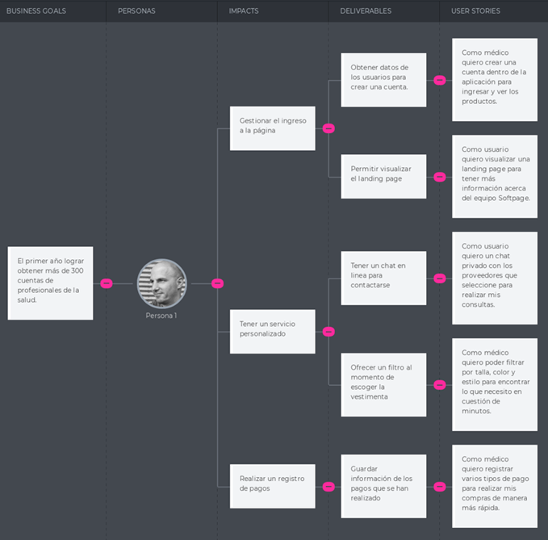
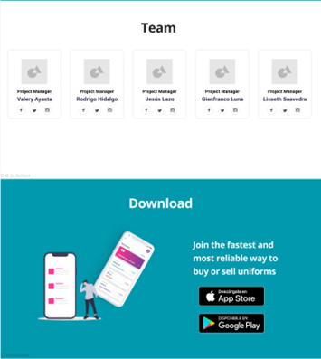

<p align="center">
    
</p>

# Grupo 4 - Trabajo de Aplicaciones Web

### Ingeniería de Sistemas y Computación | Ingeniería de Software

### Sección

WX53

### Profesor

Naldo Reupo-Musayon Gastulo

## Reporte TP1

**Nombre del startup:** SoftPage

**Nombre del producto:** LookMedico

### Team Members

- Hidalgo Rodriguez, Alvaro Rodrigo
- Saavedra Curi, Lisseth Yahaira
- Sagastegui Rodriguez, Luis Jesus
- Serrano Uchuya, Gerald Patricio
- Yen Quispe, Mijael Alexander Imanol
- Espinoza Paredes, Frezzia Eldaa Isabel

## Ciclo 2023-02

# CONTENT

<!-- TOC -->
* [Grupo 4 - Trabajo de Aplicaciones Web](#grupo-4---trabajo-de-aplicaciones-web)
    * [Ingeniería de Sistemas y Computación | Ingeniería de Software](#ingeniería-de-sistemas-y-computación--ingeniería-de-software)
    * [Sección](#sección)
    * [Profesor](#profesor)
  * [Reporte TB1](#reporte-tb1)
    * [Team Members](#team-members)
  * [Ciclo 2023-02](#ciclo-2023-02)
* [CONTENT](#content)
* [STUDENT OUTCOME](#student-outcome)
* [Cap1 - INTRODUCTION](#cap1---introduction)
  * [1.1. Startup Profile](#11-startup-profile)
    * [1.1.1. Descripción de la Startup](#111-descripción-de-la-startup)
    * [1.1.2 Perfiles de los integrantes del equipo](#112-perfiles-de-los-integrantes-del-equipo)
  * [1.2. Solution Profile](#12-solution-profile)
    * [1.2.1. Antecedentes y problemática](#121-antecedentes-y-problemática)
    * [1.2.2. Lean UX Process](#122-lean-ux-process)
      * [1.2.2.1. Lean UX Problem Statements](#1221-lean-ux-problem-statements)
      * [1.2.2.2. Lean UX Assumptions](#1222-lean-ux-assumptions)
      * [1.2.2.3. Lean UX Hypothesis Statements](#1223-lean-ux-hypothesis-statements)
      * [1.2.2.4 Lean UX Canvas](#1224-lean-ux-canvas)
      * [1.2.2.5 Segmentos objetivo](#1225-segmentos-objetivo)
* [Cap2 - REQUIREMENTS ELICITATION & ANALYSIS](#cap2---requirements-elicitation--analysis)
  * [2.1. Competidores](#21-competidores)
    * [2.1.1. Análisis competitivo](#211-análisis-competitivo)
    * [2.1.1. Estrategias y tácticas frente a competidores](#211-estrategias-y-tácticas-frente-a-competidores)
  * [2.2. Entrevistas](#22-entrevistas)
    * [2.2.1. Diseño de entrevistas](#221-diseño-de-entrevistas)
    * [2.2.2. Registro de entrevistas](#222-registro-de-entrevistas)
    * [2.2.3. Análisis de entrevistas](#223-análisis-de-entrevistas)
  * [2.3. Needfinding](#23-needfinding)
    * [2.3.1. User Personas](#231-user-personas)
    * [2.3.2 User Task Matrix](#232-user-task-matrix)
    * [2.3.3. User Journey Mapping](#233-user-journey-mapping)
    * [2.3.4. Empathy Mapping](#234-empathy-mapping)
    * [2.3.5 As-is Mapping](#235-as-is-mapping)
* [3 - REQUIREMENTS SPECIFICATION](#3---requirements-specification)
  * [3.1. To-be Scenario Mapping](#31-to-be-scenario-mapping)
  * [3.2. User Stories](#32-user-stories)
  * [3.3. Impact Mapping](#33-impact-mapping)
  * [3.4. Product Backlog](#34-product-backlog)
* [Cap4 - PRODUCT DESIGN](#cap4---product-design)
  * [4.1. Style Guidelines](#41-style-guidelines)
    * [4.1.1. General Style Guidelines](#411-general-style-guidelines)
    * [4.1.2. Web Style Guidelines](#412-web-style-guidelines)
  * [4.2. Information Architecture](#42-information-architecture)
    * [4.2.1. Organization Systems](#421-organization-systems)
    * [4.2.2. Labeling Systems](#422-labeling-systems)
    * [4.2.3. SEO Tags and Meta Tags](#423-seo-tags-and-meta-tags)
    * [4.2.4. Searching Systems](#424-searching-systems)
    * [4.2.5. Navigation Systems](#425-navigation-systems)
  * [4.3. Landing Page UI Design](#43-landing-page-ui-design)
    * [4.3.1. Landing Page Wireframe](#431-landing-page-wireframe)
    * [4.3.2. Landing Page Mock-up](#432-landing-page-mock-up)
  * [4.4. Web Applications UX/UI Design](#44-web-applications-uxui-design)
    * [4.4.1. Web Applications Wireframes](#441-web-applications-wireframes)
    * [4.4.2. Web Applications Wireflow Diagrams](#442-web-applications-wireflow-diagrams)
    * [4.4.3. Web Applications Mock-ups](#443-web-applications-mock-ups)
    * [4.4.4. Web Aplications User Flow Diagrams](#444-web-aplications-user-flow-diagrams)
  * [4.5. Web Applications Prototyping](#45-web-applications-prototyping)
  * [4.6. Domain-Driven Software Architecture](#46-domain-driven-software-architecture)
    * [4.6.1. Software Architecture Context Diagram](#461-software-architecture-context-diagram)
    * [4.6.2. Software Architecture Container Diagrams](#462-software-architecture-container-diagrams)
    * [4.6.3. Software Architecture Components Diagrams.](#463-software-architecture-components-diagrams)
  * [4.7. Software Object Oriented Design](#47-software-object-oriented-design)
    * [4.7.1. Class Diagrams](#471-class-diagrams)
    * [4.7.2. Class Dictionary](#472-class-dictionary)
  * [4.8. Database Design](#48-database-design)
    * [4.8.1. Database Diagram](#481-database-diagram)
* [Cap5 - PRODUCT IMPLEMENTATION, VALIDATION & DEPLOYMENT](#cap5---product-implementation-validation--deployment)
  * [5.1. Software Configuration Management](#51-software-configuration-management)
    * [5.1.1. Software Development Environment Configuration](#511-software-development-environment-configuration)
    * [5.1.2. Software Code Management](#512-software-code-management)
    * [5.1.3. Source Code Style Guide & Conventions](#513-source-code-style-guide--conventions)
    * [5.1.4. Software Deployment Configuration](#514-software-deployment-configuration)
  * [5.2. Landing Page, Services & Applications Implementation](#52-landing-page-services--applications-implementation)
    * [5.2.1. Sprint 1](#521-sprint-1)
      * [Sprint Planning 1](#sprint-planning-1)
      * [5.2.1.2. Sprint Backlog](#5212-sprint-backlog)
      * [5.2.1.3. Development Evidence for Sprint Review](#5213-development-evidence-for-sprint-review)
      * [5.2.1.4. Execution Evidence for Sprint Review](#5214-execution-evidence-for-sprint-review)
      * [5.2.1.5 Software Deployment Evidence for Sprint Review](#5215-software-deployment-evidence-for-sprint-review)
      * [5.2.1.6 Team Collaboration Insights during Sprint](#5216-team-collaboration-insights-during-sprint)
<!-- TOC -->

# STUDENT OUTCOME

El curso contribuye al cumplimiento del Student Outcome ABET: ABET – EAC - Student Outcome 5 Criterio: La capacidad de funcionar efectivamente en un equipo cuyos miembros juntos proporcionan liderazgo, crean un entorno de colaboración e inclusivo, establecen objetivos, planifican tareas y cumplen objetivos. En el siguiente cuadro se describe las acciones realizadas y enunciados de conclusiones por parte del grupo, que permiten sustentar el haber alcanzado el logro del ABET – EAC - Student Outcome 5.

| **Criterio Específico**                                                                                                                              | **Acciones Realizadas**                                                                                                                                                                                                                                                                                                                                                                                                                                                                                                                                                                                                                                                                                                                                                                                                                                                                                                                                                                                                                                                                                                                                                                                                                                                                                                                                                                                                                                                                                                                                                                                                                                                                                                                                                                                                                                                                                                                                                                                                   | **Conclusiones**                                                                                                                                                                                                                                                                                                                                                                                                                                                                                                                                                                        |
|------------------------------------------------------------------------------------------------------------------------------------------------------|---------------------------------------------------------------------------------------------------------------------------------------------------------------------------------------------------------------------------------------------------------------------------------------------------------------------------------------------------------------------------------------------------------------------------------------------------------------------------------------------------------------------------------------------------------------------------------------------------------------------------------------------------------------------------------------------------------------------------------------------------------------------------------------------------------------------------------------------------------------------------------------------------------------------------------------------------------------------------------------------------------------------------------------------------------------------------------------------------------------------------------------------------------------------------------------------------------------------------------------------------------------------------------------------------------------------------------------------------------------------------------------------------------------------------------------------------------------------------------------------------------------------------------------------------------------------------------------------------------------------------------------------------------------------------------------------------------------------------------------------------------------------------------------------------------------------------------------------------------------------------------------------------------------------------------------------------------------------------------------------------------------------------|-----------------------------------------------------------------------------------------------------------------------------------------------------------------------------------------------------------------------------------------------------------------------------------------------------------------------------------------------------------------------------------------------------------------------------------------------------------------------------------------------------------------------------------------------------------------------------------------|
| Participa en equipos multidisciplinarios con eficacia, eficiencia y objetividad, en el marco de un proyecto en soluciones de ingeniería de software. | <p>Hidalgo Nicho, Alvaro Rodrigo-TB1:<br/>Para el avance del TB1, realizamos las reuniones con el objetivo de definir el alcance del proyecto. Asimismo, organizamos la información obtenida bajo el enfoque de Lean UX de acuerdo a nuestros segmentos objetivos. Algunas de mis responsabilidades fueron las siguientes tareas:<br/>- Hypothesis statements, análisis competitivo, entre otros.<br/>- Style Guidelines, landing page UI design, UX/UI design, avance del landing page</p><p>Saavedra Curi, Lisseth Yahaira-TB1:<br/>Para el desarrollo de la TB1, se realizó reuniones para acordar que le toca a cada integrantes del equipo para realizar el trabajo según la rúbrica para esta entrega. Por lo que en esta entrega me tocó realizar:<br/>- Impact mapping, Lean UX Assumptions, User Task Matrix, Entrevistas<br/>-Wireframes, mockup, wireflow,userflows,entre otros.</p><p>Sagastegui Rodriguez, Luis Jesus<br/>TB1:<br/>En el primer Sprint nos dividimos tareas especificas entre cada integrante del grupo de los distintos capitulos. En esta entrega se me asigno distintas tareas por realizar, tales como: Los resumenes de las entrevistas, elaboraciones de los User Journey Mapping, los To-Be Scenario Mapping, planteamiento de antecedentes y problematica, etc. </p><p>Serrano Uchuya, Gerald Patricio<br/>TB1:<br/>Debido a la longitud de la primera entrega más el primer sprint, decidimos separar el proyecto equitativamente en cuanto al informe, para luego poder trabajar en el landing page en conjunto.Las tareas que realicé incluyen:<br/>- User Journey<br/>- Problemática<br/>- Landing Page<br/>- Diagrama C4, entre otros</p><p>Yen Quispe, Mijael Alexander Imanol<br/>TB1:<br/>Nos dividimos las distintas partes del proyecto capitulo por capitulo, porque había que avanzar de manera progresiva. En el último capítulo, trabajamos de manera colaborativa en GitHub:<br/>- SEO Meta Data<br/>- Desarrollo de Landing Page<br/>- Arquitectura del software</p> | <p>TB1:Para esta primera parte, fue necesario colaborar de manera organizada y con tareas definidas bajo la metodología Lean UX. De esta manera, mediante las entrevistas pudimos conocer las necesidades de nuestros usuarios y direccionar nuestra propuesta a cubrir aquellas necesidades.Comprendimos la importancia de asumir responsabilidades y apoyarnos conjuntamente en las dificultades encontradas. Por esta razón, la investigación previa en nuestra propuesta nos permitirá afrontar de manera sólida el desarrollo de la aplicación web en las siguientes entregas.</p> |
| Conoce al menos un sector empresarial o dominio de aplicación de soluciones de software.                                                             | <p>Hidalgo Nicho, Alvaro Rodrigo-TB1:<br/>Para el avance del TB1, definimos qué tipo de usuarios formarían parte de nuestro segmento objetivo. Además, mediante el análisis competitivo, pudimos comprender la importancia del negocio. En el caso de los usuarios, pudimos comprenderlos mejor gracias a las entrevistas, los user persona o los user stories, obteniendo así los user goals.En el diseño del landing page y los wireframes, se buscó satisfacer la necesidad y satisfacción de nuestros usuarios.</p><br/><p>Saavedra Curi, Lisseth Yahaira<br/>TB1: <br/>Para esta entrega, se investigó sobre el tema que queríamos abordar y para ello era importante saber quiénes eran nuestros principales usuarios para comprender mejor la problemática y poder satisfacer la necesidad de nuestro público objetivo se tuvo que realizar wireframes y  mockups.</p><p>Sagastegui Rodriguez, Luis Jesus<br/>TB1:<br/>Para tener una amplia vision del sector empresarial, tuvimos que realizar varias tareas previas en los capitulos para estudiar de una manera mas profunda y poder aplicar de manera efectiva soluciones con respecto al software, tales como: La elaboración de los Diagrama de Clases y el Database Diagram.</p><p>Serrano Uchuya, Gerald Patricio<br/>TB1:<br/>Esta parte del trabajo requirió la investigación a profundidad de las necesidades de nuestros segmentos objetivos, así como el diseño del landing page que introduzca adecuadamente nuestro producto y sea de su agrado. Esto se logro mediante la realización de wireframes, mockups y que todo el equipo siguiese la guía de estilos. </p><p>Yen Quispe, Mijael Alexander Imanol<br/>TB1:<br/>Investigación de SEO y metodología de trabajo colaborativa en GitHub. Gitflow, convenciones para codificación. Sintaxis de Markdown para capacitación.</p>                                                                                                                                                                 | <p>TB1:<br/>El desarrollo de la documentación de lo desarrollado en el sprint nos permite tener una auditoría completa sobre nuestro proyecto, además de organizar roles y trabajos a cada miembro del equipo para trabajar de manera organizada.</p>                                                                                                                                                                                                                                                                                                                                   |

# Cap1 - INTRODUCTION

## 1.1. Startup Profile

### 1.1.1. Descripción de la Startup

SoftPage es una innovadora startup que se enfoca en proporcionar soluciones tecnológicas avanzadas a través de aplicaciones de software, ya sean web o móviles.

Como nuevo producto, presentamos LookMedico, nuestra aplicación web diseñada específicamente para abordar las necesidades de vestimenta de los profesionales médicos. 

Nuestra meta principal es ayudar a los profesionales de la salud a sentirse cómodos y seguros en su entorno de trabajo a través de LookMedico. Con esta plataforma, facilitamos la conexión entre nuestros clientes y proveedores de confianza que están dispuestos a personalizar la ropa médica según las preferencias individuales.

En SoftPage, nuestro compromiso es ofrecer un servicio excepcional al cliente y operar de manera ética y sostenible para cultivar relaciones sólidas y duraderas con nuestros usuarios. Nos esforzamos por ser un socio confiable y esencial en la vida diaria de los profesionales de la salud, asegurando que puedan desempeñar su trabajo con comodidad y confianza.

**Misión**

Nuestra misión es ofrecer una amplia gama de productos para profesionales y estudiantes del área de Ciencias de la Salud, desde uniformes hasta accesorios, con opciones personalizables para adaptarse a las preferencias individuales de los clientes

**Visión**

Nuestra visión es ser la marca líder en vestimenta para médicos, con una reputación sólida y confiable para el mercado.

### 1.1.2 Perfiles de los integrantes del equipo

|            Nombre completo             |                                                                                                                                                                                                                                        Descripción                                                                                                                                                                                                                                         |                 Foto                 |
|:--------------------------------------:|:------------------------------------------------------------------------------------------------------------------------------------------------------------------------------------------------------------------------------------------------------------------------------------------------------------------------------------------------------------------------------------------------------------------------------------------------------------------------------------------:|:------------------------------------:|
|     Hidalgo Nicho, Alvaro Rodrigo      | Soy estudiante de Ing. de Software, me gusta el impacto que genera la tecnología en la actualidad y cómo podemos influir en su desarrollo. Me interesa el campo de la inteligencia artificial y actualmente formo parte de un proyecto enfocado en su aplicación. Soy una persona sociable, que gusta de aportar con ideas y tareas con mis equipos. Para el presente trabajo busco aportar con mi equipo en el diseño y desarrollo de los conceptos y aplicativo web de manera constante. |   |
|     Saavedra Curi, Lisseth Yahaira     |                                                                       Soy estudiante de la carrera de Ingeniería de Software, me considero una persona organizada, responsable y empática con los proyectos que debo realizar en cada entrega. En mis tiempos libres suelo ir a nadar, manejar bicicleta, escuchar música, programar. Me gusta diseñar e innovar por lo que considero que puedo aportar a mi equipo.                                                                       |  |
|    Sagastegui Rodriguez, Luis Jesus    |                                       Mi nombre es Jesus Sagastegui, tengo 20 años y estudio la carrera de Ingenieria de Software. Soy una persona con muchas metas a futuro y con mis objetivos claros, que siempre le gusta aprender algo nueva cada día y sobretodo me gusta trabajar en equipo. Tengo el conocimiento de muchos lenguajes de programacion que espero sean de ayuda para el trabajo colectivo del equipo en este ciclo academico.                                       |     |
|    Serrano Uchuya, Gerald Patricio     |                                                      Actualmente estudio la carrera de Ingeniería de Software. Estoy dispuesto a trabajar en equipo y aceptar diferentes ideas para obtener los mejores resultados. He usado lenguajes como C++, C#, y JS. Estoy preparado para aprender nuevas tecnologías de utilidad para el proyecto. Planeo trabajar como FullStack Dev y, aunque suponga un reto, estoy dispuesto a superarlo.                                                       |   |
|  Yen Quispe, Mijael Alexander Imanol   |                      Estudio la carrera de Ingeniería de Software. Actualmente estoy interesado en el campo de Ciberseguridad por mi trabajo actual, además del Desarrollo de Videojuegos, donde hago desarrollo de mods a modo de hobbie. Tengo experiencia en manejo de bases de datos y en lenguajes como JS, C++, Python, Java y C#. Me considero una persona colaborativa, dispuesta a tomar la iniciativa para la realización de trabajos y proyectos grupales.                      |   |
| Espinoza Paredes, Frezzia Eldaa Isabel |                                                                                                                 Actualmente estudio la carrera de Ingeniería de Software. Tengo bastante conocimiento en varios lenguajes de programación. El campo que más me gusta es el desarrollo de videojuegos. Me considero una persona responsable y comprometida con mis deberes.                                                                                                                 |  |

## 1.2. Solution Profile

### 1.2.1. Antecedentes y problemática

A lo largo de la historia de la medicina, los uniformes utilizados en el ámbito sanitario han experimentado notables transformaciones. En la actualidad, estos deben cumplir con una serie de criterios rigurosos para ser autorizados en entornos médicos, que incluyen la necesidad de ofrecer plena libertad de movimiento, estar confeccionados con materiales hipoalergénicos y ser resistentes a sustancias perjudiciales, entre otros requisitos. Esta exigencia de mantener los uniformes en condiciones óptimas implica la necesidad de un mantenimiento constante. Sin embargo, se enfrenta a un desafío importante debido a la falta de una plataforma segura y confiable que facilite la realización de pedidos en base a las especificaciones mencionadas, así como la ausencia de un control adecuado en el proceso de entrega de estos uniformes sanitarios.

1. What (Qué) **¿Cuál es el problema?**

&nbsp;&nbsp;&nbsp;&nbsp;Los profesionales y estudiantes de medicina necesitan una indumentaria para realizar su trabajo. Sin embargo, no siempre reciben un producto de calidad. Además, existen problemas al momento de la entrega del producto, errores en la orden (cantidad, modelo, fecha), falta de gestión y la frustración de no recibir un producto que ofrezca protección y comodidad.

&nbsp;&nbsp;&nbsp;&nbsp;Los proveedores de ropa médica no pueden promocionar sus productos, pues no tienen acceso a publicidad, ni conocimiento de cómo alcanzar a más clientes por un medio digital, pues no saben cómo usar redes sociales.

2. When (Cuándo) **¿Cuándo sucede el problema?**

&nbsp;&nbsp;&nbsp;&nbsp;El problema sucede cuando el personal médico adquiere sus uniformes de trabajo, sea de manera presencial o de manera virtual. Consumen parte de su horario de descanso o trabajo para concluir la compra. Actualmente, presenta inconvenientes ante la falta de accesibilidad y alternativas.

&nbsp;&nbsp;&nbsp;&nbsp;Por parte de los proveedores, sucede cuando los proveedores quieren vender sus productos de manera on-line, pero no cuentan con el conocimiento para ello.

3. Where (Dónde) **¿Dónde ocurre el problema?**

&nbsp;&nbsp;&nbsp;&nbsp;La problemática ocurre en los centros de trabajo (hospitales, clínicas, consultorios) o de estudios (universidades, institutos, escuelas) en el Perú de todas las especialidades médicas. El problema está en el contacto con el proveedor y la producción que este último realiza.

&nbsp;&nbsp;&nbsp;&nbsp;Por parte de los proveedores, ocurre en sus centros de producción, donde ellos reciben sus pedidos y en el lugar de entrega, donde el cliente no está satisfecho.

4. Who (Quién) **¿Quién es afectado por el problema?**

&nbsp;&nbsp;&nbsp;&nbsp;El problema lo tienen los profesionales y estudiantes de medicina que desean adquirir sus uniformes de trabajo y no se encuentran satisfechos con su recepción o el tiempo empleado en su adquisición y tambien ponen en riesgo su salud.

&nbsp;&nbsp;&nbsp;&nbsp;Además, el proveedor se ve afectado, pues hay una disminución de sus ingresos, pues no cuenta con un factor de diferenciación respecto a sus competidores.

5. Why (Por qué) **¿Por qué ocurre el problema?**

&nbsp;&nbsp;&nbsp;&nbsp;El problema sucede porque no se contacta a un proveedor confiable y de calidad, el cual no tiene la experiencia suficiente en el rubro o no es capaz de satisfacer las exigencias del cliente con el producto. Por lo que el cliente presenta quejas como número incorrecto de uniformes, características erróneas, demora en fechas de entrega, etc.

&nbsp;&nbsp;&nbsp;&nbsp;Por parte de los proveedores, la causa es la falta de conocimiento de medios digitales para diferenciarse de sus competidores. Esto genera que tenga una menor aceptación con los clientes, ya que están acostumbrados a la venta tradicional.

6. How (Cómo) **¿Cómo resolver el problema?**

&nbsp;&nbsp;&nbsp;&nbsp;El problema se puede resolver mediante una propuesta en línea, donde a través de una solución web, se pueda conectar a los proveedores con una red de clientes. 

&nbsp;&nbsp;&nbsp;&nbsp;Asimismo, los clientes puedan contactar a los proveedores y realizar especificaciones sobre su pedido, para que su entrega sea la correcta.

7. How much (Cuánto) **¿Cuánto costaría resolver el problema?**

&nbsp;&nbsp;&nbsp;&nbsp;Los problemas radican principalmente en la calidad del producto. Existe un patrón acerca del material textil con el que se fabrica. Según Unión Medical (2022), cuando no se utilizan productos con las tecnologías adecuadas, se incurre en un gasto sin beneficio. Por lo tanto, una vestimenta que no ofrece la protección necesaria no es viable para los médicos.

&nbsp;&nbsp;&nbsp;&nbsp;El Perú tiene 12,8 médicos por cada 10 000 habitantes. Además, según estadísticas del Minsa (2023), existen 8279 establecimientos de salud a nivel nacional. Por otro lado, existen 165 hospitales y 11 institutos especializados. Según Susalud (2023), existen 24,959 de Instituciones prestadoras de servicios de salud en el Perú.

### 1.2.2. Lean UX Process

#### 1.2.2.1. Lean UX Problem Statements

**Problem Statement 1**

El presente contexto requiere de un gestor, o intermediario, para la compra y entrega de uniformes de profesionales de la salud. A través de este gestor, dichos profesionales podrán realizar el pedido y recibirlos en el menos tiempo posible.

Hemos estudiado informes y notas periodísticas relacionadas a este tema, y hemos podido concluir que existe una gran demanda a nivel nacional de estos uniformes. Actualmente, esta demanda requiere una gran inversión inicial de tiempo, específicamente para la búsqueda del uniforme adecuado, además de comprarlo en el mercado local o importarlo del extranjero.

Todo este proceso es largo y tardado, conlleva a que médicos y gente que trabaja en laboratorio carezcan de sus uniformes en tiempos críticos, por lo que es necesario agilizar todo el proceso, además de garantizar la calidad y cumplimiento de normas sanitarias de las prendas.

**¿Cómo podemos lograr un servicio de calidad que garantice una experiencia de compra agradable, rápida y confiable para los profesionales de la salud?**


**Problem Statement 2**

Nuestro contexto demanda que los proveedores tengan un mayor alcance para vender sus productos, y así, poder llegar a una mayor cantidad de clientes. De esta manera, necesitará gestionar los pedidos entrantes y la entrega de ellos.

Hemos observado que los proveedores de ropa para médicos no tienen una forma eficaz de gestionar los pedidos y las entregas. De igual manera, les cuesta adaptarse a las nuevas tecnologías y promocionar su negocio por internet.

**¿Cómo los proveedores pueden gestionar sus pedidos y entregas de una manera efectiva, a la vez que consiguen un mayor alcance de clientes?**

#### 1.2.2.2. Lean UX Assumptions

**¿Quién es el usuario?** 

Son los profesionales y estudiantes del área de salud, ya que son los que necesitan una plataforma que les permita obtener sus uniformes con una buena gestión con el proveedor.

De igual manera, identificamos también a los proveedores de textiles, ya que necesitan llegar a los profesionales de la salud de manera eficaz.

**¿Dónde encaja nuestro producto en su trabajo o vida?**

Durante el desarrollo de la etapa universitaria, especialmente en las prácticas, y profesional de los usuarios del primer segmento, ya que será una herramienta para adquirir sus uniformes sanitarios. Así mismo, destacará el valor agregado al brindar diferentes opciones y características en base a las especificaciones del usuario.

**¿Qué problemas tiene nuestro producto? ¿Qué se debe resolver?**

En general, la principal problemática de nuestro producto es la falta de confianza de los usuarios. Esto puede limitar su disposición a involucrarse en la iniciativa.

Con el fin de resolver el problema, LookMedico está diseñado para brindar información detallada y transparente sobre los uniformes y opciones de pago o recojo. Además, se busca garantizar la seguridad y fomentar la participación de los usuarios en la iniciativa.

**¿Cuándo y cómo es usado nuestro producto?**

Es usado cuando nuestros usuarios están en su tiempo libre y deseen realizar un reemplazo de sus uniformes actuales, el cual se usará mediante el ingreso a la plataforma en cualquier dispositivo.

**¿Qué características son importantes?**

Es importante resaltar que nuestra página web mantendrá informado al cliente desde el proceso de compra hasta que se le entregue el producto, así mismo presentará las siguientes características:

- Interfaz intuitiva
- Compatibilidad
- Facilidades de pago
- Actualización constante del stock de productos
- Personalización de las preferencias y gustos del usuario

**¿Cómo atraemos clientes?** 

Por medio de publicidades en páginas web o blogs relacionados a la medicina, además de los sistemas de Ads de varias redes sociales. Debemos asegurarnos en que el usuario vea satisfecha de manera sencilla sus principales problemas al comprar de manera virtual o presencial.

**¿Qué problemas tendría que resolver nuestro producto en el mercado?**

Qué nuestro producto sea reconocido y genere confianza, ya que, al existir publicidad de otros productos, es complicado que un anuncio destaque. Sin embargo, creemos que los clientes al ver el seguimiento de compra y obtener un producto de calidad nos recomendarán e iremos creciendo rápidamente en el mercado.

**¿Qué tiene nuestro producto?**

Nuestra startup contará con un sistema ordenado para una compra eficaz sin percances hacia el cliente.

La plataforma tendrá actualizaciones constantes para una mejor experiencia del usuario.

#### 1.2.2.3. Lean UX Hypothesis Statements

**Hypothesis Statement (1):** ¿Cómo podemos garantizar un servicio de calidad que garantice una experiencia de compra agradable, rápida y confiable para los profesionales de la salud?

**Creemos que,** al generar una interacción directa a través de una aplicación web entre los profesionales de la salud y distintos fabricantes de las prendas, les permitirá conocer mejor a los proveedores para verificar la calidad de las prendas y generar mayor confianza para contratar sus servicios.

**Sabremos que** hemos tenido éxito

**Cuando** registremos más de un 80% de reseñas positivas por parte de los profesionales de la salud.

<br>

**Creemos que,** si se notifica al usuario recomendaciones sobre prendas basadas en su historial de búsquedas y compras frecuentes, ayudará al usuario a encontrar prendas de manera rápida y efectiva.

**Sabremos que** hemos tenido éxito

**Cuando** veamos una mayor actividad y un aumento progresivo en la cantidad de compras generadas por usuario durante los primeros 6 meses de creada la cuenta.

<br>

**Creemos que,** habilitar una búsqueda con filtros de los productos en base a los proveedores, tipo de uniforme y precios, facilitará al cliente poder encontrar las prendas acordes a su necesidad de manera más rápida. 

**Sabremos que** hemos tenido éxito 

**Cuando** veamos un aumento constante en la cantidad de búsquedas y compras mensuales.

<br>

**Creemos que,** tener un seguimiento a las preferencias de los compradores, nos permitirá mejorar la interacción y realizar actualizaciones constantes para mejorar su funcionalidad. 

**Sabremos que** hemos tenido éxito 

**Cuando** veamos que los compradores pasan más tiempo usando la aplicación.

<br>

**Hypothesis Statement (2):** ¿Cómo los proveedores pueden gestionar sus pedidos y entregas de una manera efectiva, a la vez que consiguen un mayor alcance de clientes?

**Creemos que,** permitiendo a los proveedores poder crear una tienda virtual les facilitará la gestión de sus prendas y tener más efectividad en sus ventas.

**Sabremos que** hemos tenido éxito

**Cuando** registremos un incremento constante de cuentas de proveedores durante el primer año.

<br>

**Creemos que,** contar con una sección de inventario para los proveedores, les permitirá tener un control exacto de su stock de productos, categorizarlos, gestionar precios y consultar las ventas generadas en su tienda virtual.

**Sabremos que** hemos tenido éxito 

**Cuando** verifiquemos que más del 50% de proveedores registran un acceso constante a la sección de inventario.

<br>

**Creemos que,** ayudar a los proveedores a organizar su tienda virtual mediante un tutorial, facilitará a que ellos puedan aprender a utilizar las herramientas de la aplicación y empezar a vender de manera más rápida y organizada.

**Sabremos que** hemos tenido éxito 

**Cuando** verifiquemos que hemos logrado fidelizar al 80% de las cuentas de proveedores.

#### 1.2.2.4 Lean UX Canvas

**Problem Statement 1**

| *Índice* | *Cuadro*                                                                | *Descripción*                                                                                                                                                                                                                                                                                                                                                                                                                                                                                                                                                                                                                                                       |
|----------|-------------------------------------------------------------------------|---------------------------------------------------------------------------------------------------------------------------------------------------------------------------------------------------------------------------------------------------------------------------------------------------------------------------------------------------------------------------------------------------------------------------------------------------------------------------------------------------------------------------------------------------------------------------------------------------------------------------------------------------------------------|
| 1        | Business Problem                                                        | <p>Hemos observado que existe una gran demanda a nivel nacional por parte de los profesionales de salud para adquirir uniformes para sus servicios. Actualmente, esta demanda conlleva a que se invierta mucho tiempo buscando el uniforme adecuado para poder comprarlo en una tienda física u online. Esto conlleva a que los profesionales de la salud carezcan de un medio efectivo para agilizar el proceso de búsqueda, compra y también garantizar la calidad de las prendas que adquieren.</p> <p>¿Cómo podemos lograr un servicio de calidad que garantice una experiencia de compra agradable, rápida y confiable para los profesionales de la salud?</p> |
| 2        | Business Outcomes                                                       | <p>Mayores facilidades en la selección de prendas que desean comprar los médicos</p> <p>Agilización en el proceso para encontrar un fabricante responsable</p> <p>Satisfacción de las clínicas y hospitales para contratar proveedores</p>                                                                                                                                                                                                                                                                                                                                                                                                                          |
| 3        | Users and customers                                                     | <p>Médicos y estudiantes que requieran un constante mantenimiento de uniformes sanitarios</p>                                                                                                                                                                                                                                                                                                                                                                                                                                                                                                                                                                       |
| 4        | User benefits                                                           | <ul><li>Tener uniformes médicos de calidad</li><li>Cumplimiento de las fechas de entrega de los uniformes</li><li>Cumplimiento de las especificaciones requeridas por el cliente</li>                                                                                                                                                                                                                                                                                                                                                                                                                                                                               |
| 5        | Solution ideas                                                          | <ul><li>Facilitar un servicio de interacción entre médicos o instituciones y fabricantes a nivel nacional</li><li>Desarrollar una aplicación para agilizar el comercio entre profesionales de la salud y fabricantes</li>                                                                                                                                                                                                                                                                                                                                                                                                                                           |
| 6        | Hypothesis                                                              | <p>Creemos que, al generar una interacción directa entre los profesionales de la salud y distintos fabricantes de las prendas, les permitirá conocer mejor a los proveedores para verificar la calidad de las prendas y generar mayor confianza para contratar sus servicios.</p><p>Sabremos que hemos tenido éxito</p><p>Cuando registremos más de un 80% de reseñas positivas por parte de los profesionales de la salud.</p>                                                                                                                                                                                                                                     |
| 7        | What’s the most important thing we need to learn first?                 | <p>Conocer los principales requerimientos del uniforme sanitario</p> <p>Aprender sobre los desafíos que enfrentan durante el proceso los médicos.</p>                                                                                                                                                                                                                                                                                                                                                                                                                                                                                                               |
| 8        | What’s the least amount of work to learn the next most important thing? | <p>Qué procedimientos son los más tediosos</p> <p>Llevar una estadística de cuán a menudo son las quejas del pedido</p>                                                                                                                                                                                                                                                                                                                                                                                                                                                                                                                                             |

**Problem Statement 2**

| *Índice* | *Cuadro*                                                                | *Descripción*                                                                                                                                                                                                                                                                                                                                                                                                                                                                                                                                                                                                                                     |
|----------|-------------------------------------------------------------------------|---------------------------------------------------------------------------------------------------------------------------------------------------------------------------------------------------------------------------------------------------------------------------------------------------------------------------------------------------------------------------------------------------------------------------------------------------------------------------------------------------------------------------------------------------------------------------------------------------------------------------------------------------|
| 1        | Business Problem                                                        | <p>Nuestro contexto demanda que los proveedores tengan un mayor alcance para vender sus productos, y así, poder llegar a una mayor cantidad de clientes. De esta manera, necesitará gestionar los pedidos entrantes y la entrega de ellos.</p> <p>Hemos observado que los proveedores de ropa para médicos no tienen una forma eficaz de gestionar los pedidos y las entregas.</p> <p>De igual manera, les cuesta adaptarse a las nuevas tecnologías y promocionar su negocio por internet.</p> <p>¿Cómo los proveedores pueden gestionar sus pedidos y entregas de una manera efectiva, a la vez que consiguen un mayor alcance de clientes?</p> |
| 2        | Business Outcomes                                                       | <p>Mayores facilidades en la selección de prendas que desean comprar los médicos</p> <p>Agilización en el proceso para encontrar nuevos clientes.</p> <p>Satisfacción de los clientes y aumento de pedidos de ellos.</p>                                                                                                                                                                                                                                                                                                                                                                                                                          |
| 3        | Users and customers                                                     | <p>Proveedores o fabricantes de uniformes sanitarios.</p>                                                                                                                                                                                                                                                                                                                                                                                                                                                                                                                                                                                         |
| 4        | User benefits                                                           | <ul><li>Poder tener clientes leales con su marca.</li><li>Comunicación directa con el cliente.</li>                                                                                                                                                                                                                                                                                                                                                                                                                                                                                                                                               |
| 5        | Solution ideas                                                          | <ul><li>Facilitar a los fabricantes a contactar con servicios de envío para sus productos</li><li>Mantener organizado el inventario de acuerdo con las especificaciones de los clientes</li>                                                                                                                                                                                                                                                                                                                                                                                                                                                      |
| 6        | Hypothesis                                                              | <p>Creemos que, permitiendo a los proveedores poder crear una tienda virtual les facilitará la gestión de sus prendas y tener más efectividad en sus ventas.</p> <p>Sabremos que hemos tenido éxito</p> <p>Cuando registremos un incremento constante de cuentas de proveedores durante el primer año.</p>                                                                                                                                                                                                                                                                                                                                        |
| 7        | What’s the most important thing we need to learn first?                 | <p>El alcance geográfico del proveedor para que pueda organizarse y validar los pedidos.</p> <p>Que los proveedores cumplan con los requerimientos básicos en cuanto a la calidad del uniforme sanitario.</p>                                                                                                                                                                                                                                                                                                                                                                                                                                     |
| 8        | What’s the least amount of work to learn the next most important thing? | <p>Cuán lejos se encuentran los proveedores de los usuarios.</p> <p>Verificar que la calidad del producto sea la indicada.</p>                                                                                                                                                                                                                                                                                                                                                                                                                                                                                                                    |

#### 1.2.2.5 Segmentos objetivo

**Profesionales de la Salud** 

Nuestro producto/servicio está dirigido a profesionales de la salud de distintas áreas médicas, que buscan soluciones innovadoras y eficientes para mejorar la calidad de la atención que brindan a sus pacientes. Nos enfocamos en brindar soluciones prácticas y personalizadas que satisfagan las necesidades específicas de cada profesional.
Nuestro público objetivo está compuesto por médicos, enfermeros, terapeutas y otros profesionales de la salud que valoran la tecnología y la innovación como herramientas para mejorar la calidad de la atención que brindan a sus pacientes. Ellos son de clase media alta y viven en el Perú. Nos enfocamos en aquellos profesionales que buscan soluciones prácticas y efectivas para optimizar sus procesos de trabajo, mejorar la precisión de sus diagnósticos y tratamientos, y aumentar la seguridad y comodidad de sus pacientes.

Además, nos enfocamos en aquellos profesionales que valoran la formación continua y la actualización constante en su área de trabajo. Buscamos establecer relaciones de confianza y colaboración con nuestros clientes, y ofrecerles soluciones personalizadas que satisfagan sus necesidades específicas.

**Proveedores a la fabricación de vestimenta médica**

Buscamos proveedores de textiles médicos que puedan proporcionar productos de alta calidad, cómodos y seguros para el personal médico. Se necesitan productos textiles médicos como batas, uniformes de enfermería, mascarillas y otros productos relacionados con la higiene y la seguridad del personal médico. Se espera una entrega recurrente de productos y la capacidad de cumplir con los requisitos de volumen de la orden.

Es importante que los proveedores cuenten con las certificaciones y acreditaciones necesarias, como la acreditación de la FDA o ISO, para garantizar la calidad y seguridad de los productos. También se valorará positivamente a los proveedores que ofrezcan soluciones personalizadas y flexibles para adaptarse a las necesidades específicas del proyecto.

Los proveedores deben tener una tienda física o virtual en alguna red social, y deben estar comprometidos con las normas de higiene y seguridad al diseñar y fabricar uniformes. Los uniformes deben ser cómodos y permitir la libertad de movimiento, pero también deben cumplir con las normas de higiene y seguridad para garantizar un ambiente limpio y seguro para los pacientes y el personal médico.

# Cap2 - REQUIREMENTS ELICITATION & ANALYSIS

## 2.1. Competidores

### 2.1.1. Análisis competitivo

| Competitive Analysis Landscape                                                                                                                                                                        |
|-------------------------------------------------------------------------------------------------------------------------------------------------------------------------------------------------------|
| <ul><li> ¿Por qué llevar a cabo este análisis?</li><li>¿Cómo conoceremos mejor a nuestra competencia y diferenciarnos para obtener una ventaja competitiva ante la preferencia de los usuarios? </li> |

| Marcas              | Elivetni                                              | Norvil                                                                                                                                                                                                                                                                                                                                                                                                                          | Medshop                                                                                                                                                                                                                             |     |
|---------------------|-------------------------------------------------------|---------------------------------------------------------------------------------------------------------------------------------------------------------------------------------------------------------------------------------------------------------------------------------------------------------------------------------------------------------------------------------------------------------------------------------|-------------------------------------------------------------------------------------------------------------------------------------------------------------------------------------------------------------------------------------|-----|
| Perfil              | Overview                                              | Consiste en una Startup que permite a los profesionales en la salud conectar directamente con los fabricantes para adquirir uniformes de calidad.                                                                                                                                                                                                                                                                               | Empresa textil peruana con 6 años en el mercado, especializada en la fabricación de uniformes, entre ellos, para el sector salud. Realiza la venta de sus productos mediante su tienda virtual.                                     |     |
|                     | Ventaja competitiva ¿Qué valor ofrece a los clientes? | Conecta directamente a los especialistas de la salud o instituciones que requieran uniformes, con los fabricantes y distribuidores. Esta interacción, permite a los compradores, poder comparar precios, tiempo de entrega, pedidos y conocer la experiencia de los proveedores evitando así problemas como estafas, demoras en entregas, errores de envío. Asimismo, se reduce el tiempo de búsqueda y compra de los usuarios. | Como fabricantes, han diseñado un catálogo virtual o una revista digital donde muestran todos los diseños de sus productos. Además, son bien activos en redes sociales y tienen clientes corporativos, así como personas naturales. |     |
| Perfil de Marketing | Mercado objetivo                                      | Profesionales del sector salud e instituciones de la salud                                                                                                                                                                                                                                                                                                                                                                      | Profesionales de diversos campos e instituciones.                                                                                                                                                                                   |     |
|                     | Estrategias de marketing                              | Difusión inicial mediante redes sociales con recomendaciones de médicos y proveedores.                                                                                                                                                                                                                                                                                                                                          | Redes sociales, clientes leales y catálogo virtual.                                                                                                                                                                                 |     |
| Perfil de Producto  | Productos & Servicios                                 | Permite a los usuarios buscar fabricantes a nivel nacional para consultar calidad y precios de uniformes médicos.                                                                                                                                                                                                                                                                                                               | Tienda virtual que ofrece la venta de uniformes para sectores como industrias, educación, salud, gastronomía y hotelería y una sección de catálogo.                                                                                 |     |
|                     | Precios & Costos                                      | El uso de la aplicación es gratuito.                                                                                                                                                                                                                                                                                                                                                                                            | La tienda virtual es de uso gratuito, solo se cobra por la compra de productos.                                                                                                                                                     |     |
|                     | Canales de distribución (Web y/o Móvil)               | Aplicación móvil                                                                                                                                                                                                                                                                                                                                                                                                                | Web                                                                                                                                                                                                                                 |     |
| Análisis SWOT       | Fortalezas                                            | Aprovechamos la necesidad de los médicos de encontrar uniformes cómodos, de calidad y a nivel nacional.                                                                                                                                                                                                                                                                                                                         | Experiencia en el rubro.                                                                                                                                                                                                            |     |
|                     | Debilidades                                           | -Desconfianza de compradores para usar la app. - Resistencia en usuarios de la tercera edad. - Poca difusión de la app.                                                                                                                                                                                                                                                                                                         | No cuenta con una aplicación, gran competencia de microempresarios                                                                                                                                                                  |     |
|                     | Oportunidades                                         | Conectar directamente a los fabricantes y compradores a nivel nacional                                                                                                                                                                                                                                                                                                                                                          | Tiene sus propios diseños y aprovecha el marketing digital para promocionar sus productos                                                                                                                                           |     |

### 2.1.1. Estrategias y tácticas frente a competidores

Nuestra principal fortaleza es la conexión en el servicio de compra de ropa entre los clientes y los proveedores a nivel nacional. Esto permitirá ofrecer un mayor beneficio a las tiendas para ofrecer sus productos. La calidad de la muestra permitirá al usuario conocer y apreciar el producto que va a adquirir.

Dentro de nuestras estrategias para ingresar en el mercado de la moda médica, tenemos:

- Alianzas corporativas con tiendas medianas y grandes para ofrecerles mejor proyección de sus servicios y experiencia de compra
- Uso de las redes sociales como Facebook, Instagram y Tiktokk, y plataformas como Youtube, para poder darse a conocer al público, generar tendencias, y seguidores
- Nuestra iniciativa permitirá una participación del público mediante comentarios y encuestas orientados a las mejoras de esta.
- Permitirá que los usuarios puedan usarla en cualquier lugar, únicamente con internet.
- Tanto clientes como empresas puedan recibir notificaciones de interés cuando un cliente aplique los filtros de búsqueda o preferencias de compra.

## 2.2. Entrevistas

### 2.2.1. Diseño de entrevistas

**Preguntas para los Profesionales de la Salud**

1. ¿Cuál es tu nombre y tu edad?
2. ¿Tu estado civil es soltero(a), casado(a) u otro?
3. ¿En qué área del sector salud te desempeñas?
4. ¿Cuál es tu ciudad de residencia?
5. ¿Trabajas en el sector privado o público?
6. ¿Con cuánta frecuencia compras uniformes, mandiles o ropa quirúrgica?
7. ¿Dónde suele comprar estas prendas, en su ciudad o en otra ciudad?
8. ¿Puedes explicarnos el proceso cuando buscas y compras tu vestimenta?
9. ¿En qué modalidad prefieres comprar en presencial u online y por qué?
10. ¿Cuánto tiempo te demoras comprando tus prendas?
11. ¿Cuáles son los percances o inconvenientes con la entrega de tu pedido?
12. ¿Consideras necesario pasar mucho tiempo comprando tus prendas? 
13. ¿Cómo crees que se podría mejorar la experiencia de compra?
14. ¿Qué es lo que observas cuando compras y te pruebas tu uniforme, te sientes satisfecho con la compra?
15. ¿Qué te parece la idea de usar una aplicación para poder contactar con fabricantes o distribuidores de vestimentas del sector salud a nivel nacional?
16. ¿Desearías poder guardar y/o editar tu último pedido en un perfil de usuario para agilizar tu próxima compra?
17. ¿Qué te gustaría que pudieras hacer con la aplicación?
18. ¿Qué beneficios consideras importante que podría darte?
19. ¿Qué es lo que más te gustaría tener en la aplicación mencionada?
20. ¿Qué tipo de navegador usas frecuentemente?
21. ¿Qué tipo de dispositivos usas más y cuánto tiempo los usas?

**Preguntas para los Proveedores Textiles**

1. ¿Cuál es tu nombre y tu edad?
2. ¿Tu estado civil es soltero(a), casado(a) u otro?
3. ¿Cuál es tu ciudad de residencia?
4. ¿Cuánto tiempo llevas trabajando en la venta de vestimenta enfocado en el área de la salud?
5. ¿Tienes alguna página web o red social para vender tus productos?
6. ¿Cuentas con alguna tienda física para atender a tus clientes?
7. ¿Tus clientes se muestran satisfechos cuando realizan su compra?
8. ¿Has recibido alguna queja con respecto a algún pedido? Si es así, ¿cuán frecuente recibe quejas por los pedidos?
9. ¿Cómo te adaptaste a las nuevas tecnologías para vender tu producto durante la pandemia del COVID-19?
10. ¿Qué protocolos cumple actualmente tu tienda al momento de entregar tu producto al cliente?
11. ¿Qué redes sociales usan para publicitar tus productos?
12. ¿Consideras que has podido captar más clientes mediante tus redes sociales?
13. ¿Qué tipo de navegador usas frecuentemente? 
14. ¿Qué tipo de dispositivos usas más y cuánto tiempo los usas?

### 2.2.2. Registro de entrevistas

**Segmento Objetivo: Profesionales de la Salud**

**Entrevista 1:**

Nombre: Iris

Apellidos: Nicho Madueño

Edad: 63

Ciudad: Lima

Link: https://youtu.be/pHMSZO8LTRQ


**Resumen:**

Entrevista a la doctora Iris Nicho (cliente)

La doctora indica que tiene 63 años, es médico geriatra de profesión, vive en Lima y trabaja en el sector público. Respecto a su uniforme de salud, ella suele comprar 2 veces al año, aunque muchas veces ha tenido problemas para poder encontrar un proveedor que venda vestimenta de calidad y con precios adecuados. Por este motivo, suele ir a tiendas cercanas al hospital Cayetano Heredia, ya que, según nos indica, se encuentran tiendas que venden uniformes a su gusto, respecto a modelos para adultos mayores. Hasta el momento no ha presentado inconvenientes en la entrega, ya que lo hace de manera presencial. Además, nos indica que, debido a la pandemia, aumentó en gran medida su actividad de compras online y le parece que sería una gran ayuda poder contar con una aplicación como la que ofrecemos. 

Entre los principales beneficios, nos comenta que le permitiría no solo ahorrar tiempo en el proceso de búsqueda y compra, sino que también, le facilita encontrar modelos, calidad de prendas y costos adecuados al poder contactar con diversos proveedores. Finalmente, sobre los navegadores que más usa son Edge y Google Chrome, los dispositivos que más usa son celular (Android) y laptop (Windows) y debido a su trabajo, los usa en un promedio de 10 horas diarias.

**Entrevista 2**

Nombre: José Arnaldo

Apellidos: Saavedra Curi

Edad: 37 años

Ciudad: Lima

Link: https://youtu.be/COdswekiWHk


**Resumen**

Entrevista al odontólogo José Saavedra, 37 años (Profesional de la salud)

Odontólogo de profesión, él nos comenta que trabaja actualmente en sector privado que es en su consultorio privado. Él nos comenta que hace compras de implementos una vez a la semana en la av. Emancipación, se demora alrededor de 3 horas en ir y regresar a su casa, la cual eso le genera incomodidad porque pierde tiempo y quisiera optimizar ese proceso de compra porque podría realizar otras cosas en ese tiempo. Al comentarle sobre una plataforma que facilite las compras de manera online, él considera que estaría de acuerdo con utilizar por que le ayudaría a hacer compras más rápidas sin ir al establecimiento y le gustaría que haya una pestaña donde le muestre las compras frecuentes para que a la próxima compra que realice sea más rápido. Nos comenta que la red social que más utiliza es WhatsApp, Google y Facebook. Así como los dispositivos que utiliza es su celular y laptop.

**Segmento Objetivo: Proveedores Textiles**

**Entrevista 1:**

Nombre: Monica

Apellidos: Mendoza

Edad: 39 años

Ciudad: Lima

Link: https://upcedupe-my.sharepoint.com/personal/u202014249_upc_edu_pe/_layouts/15/stream.aspx?id=%2Fpersonal%2Fu202014249%5Fupc%5Fedu%5Fpe%2FDocuments%2FEntrevista%202%2Emp4&ga=1


**Resumen:**

Entrevista a empresaria Angella Trevejo, 30 años (proveedor): Economista de profesión, ella nos comenta que su empresa tiene un año y dos meses y que cuenta con una página web donde realiza ventas para todo el Perú, en Lima la entrega se demora entre 1 a 2 días y para provincias entre 5 a 7 días hábiles, pero no cuenta con una tienda física. Según nos indica ha tenido algunos inconvenientes con el horario para la entrega del producto con el courier tercerizado. Durante la pandemia ella tuvo que manejar frecuentemente las redes sociales para generar más ventas, el proceso de venta que se realiza es que el cliente realice su pago al 100% y con ello el pedido estaría en el proceso de entrega.

Sin embargo, a ella le pareció interesante que hubiera una manera de que los clientes se prueben la ropa de manera virtual ya que ayudaría a generar más ventas y generaría más confianza al cliente para realizar una compra.

Finalmente, comenta que el navegador que usa con más frecuencia es Google Chrome y la red social que usa es WhatsApp. Así como los dispositivos que usa es su celular y laptop con una frecuencia de 10 horas aproximadamente al día.

**Entrevista 2:**

Nombre: Sofia

Apellidos: Hidalgo

Edad: 48 años

Ciudad: Lima

Link: https://upcedupe-my.sharepoint.com/personal/u202014249_upc_edu_pe/_layouts/15/stream.aspx?id=%2Fpersonal%2Fu202014249%5Fupc%5Fedu%5Fpe%2FDocuments%2FEntrevista1%5FAppsWeb%2Emp4&nav=eyJyZWZlcnJhbEluZm8iOnsicmVmZXJyYWxBcHAiOiJTdHJlYW1XZWJBcHAiLCJyZWZlcnJhbFZpZXciOiJTaGFyZURpYWxvZyIsInJlZmVycmFsQXBwUGxhdGZvcm0iOiJXZWIiLCJyZWZlcnJhbE1vZGUiOiJ2aWV3In19&nav=eyJyZWZlcnJhbEluZm8iOnsicmVmZXJyYWxBcHAiOiJTdHJlYW1XZWJBcHAiLCJyZWZlcnJhbFZpZXciOiJTaGFyZURpYWxvZyIsInJlZmVycmFsQXBwUGxhdGZvcm0iOiJXZWIiLCJyZWZlcnJhbE1vZGUiOiJ2aWV3In19&ga=1


**Resumen**

Entrevista a empresaria Monica Mendoza, 39 años (proveedor)

Ella nos comenta que ha estado trabajando en el rubro de la textilería desde hace aproximadamente 5 años, pero empezó a enfocarse en el área de la salud desde la época de la pandemia.  Actualmente, la única red social por la cual publicita sus productos es por Facebook, pero empezó en el rubro por recomendaciones de amistades que ayudaron a crecer su negocio. No cuenta con una tienda física pero es una de sus metas a corto plazo, ya que se necesita de mucha capital para lograr este objetivo.

Tuvo que adaptarse de manera obligatoria a las nuevas tecnologías para no quedarse estancada en un punto y eso la ayuda mucho a crecer exponencialmente su negocio, gracias a las herramientas que las redes sociales te brindan.

Finalmente, nos comenta que esta tratando de adaptarse a Instagram para poder publicitar sus productos por esa red social pero aun no lo logra porque todo es muy nuevo para ella y el WhatsApp es una de las redes sociales que usa con mas continuidad.

**Entrevista 3**

Nombre: Angella

Apellidos: Trevejo Curi

Edad: 30 años

Ciudad: Lima

Link: https://youtu.be/jgP1GbYWu74


**Resumen**

Entrevista a empresaria Angella Trevejo, 30 años (proveedor)

Economista de profesión, ella explica que su empresa lleva funcionando un año y dos meses. Opera a través de una página web desde donde realiza ventas en todo el Perú. En Lima, los pedidos suelen entregarse en un plazo de 1 a 2 días, mientras que para provincias este plazo se extiende a 5 a 7 días hábiles. Sin embargo, no cuenta con una tienda física y depende de un servicio de mensajería subcontratado, lo que a veces ha ocasionado problemas de horarios de entrega.

Durante la pandemia, se vio obligada a administrar activamente las redes sociales para aumentar las ventas. El proceso de venta implica que el cliente realice el pago completo, lo que inicia el proceso de entrega del pedido.

Ella considera muy interesante la posibilidad de permitir a los clientes probarse la ropa de forma virtual, ya que esto podría potenciar las ventas y fortalecer la confianza del cliente al realizar una compra.

En cuanto a sus preferencias tecnológicas, utiliza principalmente Google Chrome como navegador y se apoya en WhatsApp como red social. Utiliza su teléfono móvil y su computadora portátil durante aproximadamente 10 horas al día.

### 2.2.3. Análisis de entrevistas

**Análisis por segmentos: Profesionales de la Salud**

Los profesionales de salud valoran mucho la facilidad y la accesibilidad de tener contacto directo con el proveedor para la fabricación de la vestimenta.

La mayoría de ellos mencionó que actualmente van directamente hacia la tienda para que le tomen sus medidas, escoger el material y color que necesitan, lo que puede ser tedioso y llevar mucho tiempo. 

También han experimentado problemas y frustraciones al tratar de programar un horario con el proveedor para acordar los ajustes y dudas sobre la vestimenta, como largos tiempos de espera, falta de confirmación por parte del proveedor y dificultades para tener un horario disponible.

Además, la privacidad y seguridad de sus datos de salud es una preocupación muy importante para ellos, por lo que poseer criterios de seguridad sólidas sería muy valorada. 

Los profesionales de la salud también desean tener la opción de cancelar o reprogramar sesiones en línea con el proveedor, así como recibir recordatorios de sus videoconferencias de manera rápida.

La comunicación con sus proveedores también es importante para los profesionales de la salud, y muchos de ellos desean poder comunicarse con ellos, ya sea para hacer preguntas generales o para obtener información específica sobre cómo va el estado de su vestimenta.

Por último, muchas personas no han utilizado una aplicación de programación de videoconferencias con proveedores, pero estarían dispuestos a probar una si les resulta fácil de usar y ofrece las características que buscan.

En resumen, la aplicación de programación de videoconferencia con los proveedores es ideal para los profesionales de la salud debe ser fácil de usar y accesible, segura y privada, ofrecer la opción de cancelar o reprogramar las videoconferencias, enviar recordatorios oportunos y convenientes, permitir la comunicación con sus proveedores y ofrecer las características que buscan.

**Análisis por segmentos: Proveedores textiles**

Los proveedores tienen experiencia en el rubro de venta de ropa. El 50% de los entrevistados tiene una tienda física, pero no una página web. Mientras que la otra mitad tiene una página web, pero no una tienda física. 

Por otro lado, el 100% de los proveedores indicó que tuvo inconvenientes con la entrega de sus pedidos, principalmente con la fecha de entrega. 

De igual manera, el 100% afirmó que, durante la pandemia, la venta de sus productos fue por las redes sociales. Las más utilizadas son WhatsApp. 

Por último, creen que con el presente startup podrán tener un mayor alcance de clientes y gestionar de manera eficaz sus pedidos.

## 2.3. Needfinding

### 2.3.1. User Personas

A continuación, se presentarán los User Personas, elaborados a partir del análisis de entrevistas para cada uno de los segmentos objetivos. 

Se hará una breve explicación de los artefactos a presentar y sus principales características.

Tomaremos en cuenta su descripción, objetivos, desafíos, motivaciones, frustraciones y las preferencias tecnológicas.
Este método, nos permitirá conocer mejor a los usuarios a los cuales nos estamos dirigiendo, así como identificar en relación con el análisis competitivo, qué características se pueden agregar para destacarse en el mercado.


### 2.3.2 User Task Matrix
En esta sección, presentaremos los User Task Matrix de cada uno de los segmentos objetivos, Profesionales de la Salud y Proovedores Texiles: 

**User Task Matrix: Profesional de la Salud**

<table><tr><th colspan="1" rowspan="2"><b>Task Matrix</b></th><th colspan="2"><b>Laura Gonzáles</b></th></tr>
<tr><td colspan="1"><b>Frequency</b></td><td colspan="1"><b>Importance</b></td></tr>
<tr><td colspan="1">Realizar una compra virtual</td><td colspan="1">Many</td><td colspan="1">High</td></tr>
<tr><td colspan="1">Escoger el modelo y talla de la vestimenta</td><td colspan="1">Many</td><td colspan="1" >High</td></tr>
<tr><td colspan="1">Realizar un seguimiento de compra</td><td colspan="1">Never</td><td colspan="1">Low</td></tr>
</table>

**User Task Matrix: Proveedor Textil**

<table><tr><th colspan="1" rowspan="2"><b>Task Matrix</b></th><th colspan="2"><b>Juan Pérez</b></th></tr>
<tr><td colspan="1"><b>Frequency</b></td><td colspan="1"><b>Importance</b></td></tr>
<tr><td colspan="1">Tener buen sistema de gestión de compras</td><td colspan="1">Never</td><td colspan="1">Low</td></tr>
<tr><td colspan="1">Entregar pedido con especificaciones requeridas</td><td colspan="1">Never</td><td colspan="1">Low</td></tr>
<tr><td colspan="1">Cumplir con la entrega a tiempo</td><td colspan="1">Never</td><td colspan="1">Low</td></tr>
</table>

Con respecto al Profesional de la Salud, se identificaron las siguientes tareas con mayor frecuencia e importancia:
Realizar una compra virtual y Escoger el modelo y talla de la vestimenta.

De acuerdo con las tareas señaladas, de identifican dos coincidencias con el User Persona, exactamente en su objetivo y desafío.

Con respecto al Proveedor Textil, las tareas señaladas deben ser satisfechas mediante la aplicación ya que las facilidades brindadas impulsarán los objetivos del segmento.

### 2.3.3. User Journey Mapping

En esta sección se presentarán los User Journey Mapping elaborados para cada User Persona. Primero, tenemos el journey del Cliente, que es el profesional de la salud, donde se retrata cómo, en el escenario actual, adquiere su uniforme. Después, tenemos el Journey del Proveedor, donde se sigue el proceso en el que esta entrega los pedidos a sus clientes.


### 2.3.4. Empathy Mapping

Para la elaboración de los Empathy Mapping, se estructuró las necesidades directas de los User Persona de acuerdo con su postura frente a la problemática.


### 2.3.5 As-is Mapping

En los As-is Scenario Mapping, plasmamos el procedimiento conductual de los usuarios sin la existencia de la empresa emergente. 

**As-is Scenario Mapping: Profesional de la Salud**

En este caso identificamos las dificultades que posee el usuario en la adquisición de su uniforme a través de un contacto de un proveedor desconocido.


**As-is Scenario Mapping: Proveedor Textil** 

En el caso del proveedor identificamos las dificultades de dar a conocer su negocio y la calidad de sus uniformes. Al no poseer un medio factible de marketing los usuarios dudan en optar por su contacto.


# 3 - REQUIREMENTS SPECIFICATION

Luego del análisis de la información obtenida en las investigaciones, podremos realizar las especificaciones de los requisitos de los productos digitales. Plantearemos los nuevos scenarios correspondientes para los usuarios haciendo uso de nuestro producto, identificaremos los escenarios donde los usuarios se desempañarán en la aplicación, definiremos los features a trabajar dentro del producto y finalmente definer la lista de trabajo para el equipo de desarrollo en base a los requerimientos.

## 3.1. To-be Scenario Mapping

Después de realizar y analizar los As-is Scenario Mapping, analizamos los pains que tienen nuestros usuarios y con una lluvia de ideas y una revisión e identificación de fases, elaboramos los To-Be Scenario Mapping que se presentan a continuación. 

**To-Be Scenario Mapping: Profesional de la Salud**

En este caso visualizamos la facilidad que posee el usuario en la adquisición de su uniforme a través de un contacto de un proveedor previamente seleccionado.


**To-Be Scenario Mapping: Proveedor Textil**

En el caso del proveedor identificamos las facilidades de dar a conocer su negocio y la calidad de sus uniformes. Al poseer un medio confiable donde desempeñarse el usuario proveedor iniciará su crecimiento empresarial y aumentará sus ventas.


## 3.2. User Stories

A continuación, se presentarán las User Stories, que fueron redactadas a partir de los artefactos de la sección Needfinding

| Epic/Story ID | Título                                  | Descripción                                                                                                                                               | Criterio de Aceptación                                                                                                                                                                                                                                                                                                                                                                                                                                                                                                                                                                                                                                                                                                                                                                                                                                                                                                                                                                                 | Relación con (Epic ID) |
|:--------------|:----------------------------------------|:-----------------------------------------------------------------------------------------------------------------------------------------------------------|:-------------------------------------------------------------------------------------------------------------------------------------------------------------------------------------------------------------------------------------------------------------------------------------------------------------------------------------------------------------------------------------------------------------------------------------------------------------------------------------------------------------------------------------------------------------------------------------------------------------------------------------------------------------------------------------------------------------------------------------------------------------------------------------------------------------------------------------------------------------------------------------------------------------------------------------------------------------------------------------------------------|:-----------------------|
| US01          | Creación de cuenta                      | **Como** médico **quiero** crear una cuenta dentro de la aplicación **para** ingresar y ver los productos.                                                 | <p>**Escenario 1: Creación de cuenta**</p><p>Given el médico se encuentra en la pantalla principal, </p><p>When desea registrarse e ingresa sus datos personales correctamente</p><p>Then crea su cuenta satisfactoriamente.</p><p></p><p>**Escenario 2: Error al crear la cuenta**</p><p>Given el médico se encuentra en la pantalla principal, </p><p>When desea registrase e ingresa sus datos personales erróneamente</p><p>Then aparece un mensaje de error.</p><p></p><p>**Escenario 3: Cuenta ya existente**</p><p>Given el médico se encuentra en la pantalla principal </p><p>When desea registrase e ingresa un correo ya existente</p><p>Then se le notifica la existencia de dicho correo.</p>                                                                                                                                                                                                                                                                                             | E03                    |
| US02          | Publicar mis productos                  | **Como** proveedor **deseo** publicar mi producto **para** poder llamar a los clientes                                                                     | <p>**Escenario 1: Publicación de los productos**</p><p>Given el proveedor está en su perfil</p><p>And seleccione la opción de “Market” </p><p>When le aparece un icono de signo + y accede a un formulario donde tiene que rellenar los datos y costo de la vestimenta, junto con una foto o video </p><p>Then al finalizar queda publicado en el contenido de su tienda</p><p></p><p>**Escenario 2: Stock del producto** </p><p>Dado que el proveedor quiera actualizar el stock de las prendas de su tienda </p><p>Cuando el usuario ingrese a la opción de “Inventory” </p><p>Y seleccione la vestimenta</p><p>Y le da a  “Modificar” </p><p>Entonces se actualiza el inventario y los compradores pueden ver la cantidad de prendas disponibles.</p><p></p>                                                                                                                                                                                                                                        | E02                    |
| US03          | Registro de pagos                       | **Como** médico **quiero** registrar varios tipos de pago **para** realizar mis compras de manera más rápida                                               | <p>**Escenario 1: Métodos de Pago**</p><p>Given el médico esté apunto de pagar por su vestimenta</p><p>When vaya a la opción de “Pagar” </p><p>Y le aparezca 3 formas: Tarjeta de Crédito, PayPal o Stripe</p><p>Then selecciona cualquiera de los 3 y puede guardar su método de pago.</p><p></p><p>**Escenario 2: Registro de Pagos**</p><p>Given el médico se encuentra en su perfil</p><p>When selecciona la opción de “Compras”</p><p>Then le muestra los métodos de pago más frecuentes que ha realizado.</p><p></p><p>**Escenario 3: Cambiar método de pago**</p><p>Given el médico está en su perfil</p><p>When vaya a la opción de “Métodos de pago” </p><p>Y le aparezca 3 formas: Tarjeta de Crédito, PayPal o Stripe</p><p>Then selecciona, modifica o elimina el método de pago previamente guardado.</p><p></p>                                                                                                                                                                          | E03                    |
| US04          | Gestión de Encargos                     | **Como** proveedor **quiero** saber el listado de encargos de cada cliente **para** poder organizarme en el envío de la vestimenta a su destino            | <p>**Escenario 1: Lista de Encargos**</p><p>Given el proveedor se encuentre en su perfil de empresa</p><p>When vaya a la opción Lista de Encargos</p><p>And le aparezca el nombre del médico, el producto con sus especificaciones y fecha estimada cuando finalice la elaboración  </p><p>Then el proveedor puede gestionar su tiempo de una mejor manera </p><p></p><p>**Escenario 2: Productos aproximados a la fecha de entrega**</p><p>Given el proveedor se encuentra en su “Lista de Encargos”</p><p>When selecciona una compra</p><p>Then el proveedor puede ver la información de compra del cliente para poder enviarle el producto a la dirección registrada.</p><p></p>                                                                                                                                                                                                                                                                                                                    | E02                    |
| US05          | Historial de pagos                      | **Como** proveedor **quiero** saber cuántas ventas realicé por mes **para** saber el desarrollo de mi emprendimiento                                       | <p>**Escenario 1: Registro de ventas**</p><p>Given el proveedor quiere ver sus ventas en los meses que uso la página</p><p>When ingrese a su perfil </p><p>Y a la opción “Payment”</p><p>Then visualiza sus ingresos mensuales</p><p></p><p>**Escenario 2: Meses del Año más rentables**</p><p>Dado que el proveedor quiere ver qué mes fue donde obtuvo más ganancias</p><p>Cuando se dirija a su perfil y opción de “Payment”, </p><p>Entonces selecciona la opción de estadísticas y visualiza cuáles fueron los meses más rentables.</p>                                                                                                                                                                                                                                                                                                                                                                                                                                                           | E04                    |
| US06          | Filtros de Vestimenta                   | **Como** médico **quiero** poder filtrar por talla, color y estilo **para** encontrar lo que necesito en cuestión de minutos.                              | <p>**Escenario 1: Filtros de Búsqueda**</p><p>Given el médico quiera encontrar en cuestión de minutos su uniforme</p><p>When se encuentre en la sección “Market”</p><p>And se dirige al buscado, en el lado izquierdo tendrá un icono con el nombre de Filtros</p><p>Then el médico puede seleccionar los filtros para encontrar las preferencias de su prenda</p><p></p><p>**Escenario 2: No aparecen los Filtros de Búsqueda**</p><p>Given el médico quiera encontrar en cuestión de minutos su uniforme</p><p>Cuando se encuentre en la sección “Market”</p><p>Y se dirige al buscado, en el lado izquierdo tendrá un icono con el nombre de Filtros</p><p>Entonces el médico no puede seleccionar los filtros para encontrar las preferencias de su prenda</p><p>Y le aparece un mensaje de error</p>                                                                                                                                                                                              | E02                    |
| US07          | Primera impresión del Landing Page      | **Como** visitante del sitio web, **quiero** un Landing Page atractivo y convincente **para** obtener información sobre el servicio y sus características. | <p>**Escenario 1: El usuario observa el Encabezado**</p><p>**Given** que el usuario se encuentra en el Landing Page</p><p>**When** accede a la página principal</p><p>**Then** observa un encabezado llamativo que describa la aplicación</p><p></p><p>**Escenario 2: El usuario observa Imágenes atractivas**</p><p>**Given** un visitante se encuentra en el Landing Page</p><p>**When** accede a la página principal</p><p>**Then** ve imágenes atractivas y relevantes de las funciones de la aplicación LookMedico</p><p></p><p>**Escenario 3; El usuario observa Resumen del producto**</p><p>**Given** un visitante del sitio web</p><p>**When** accede a la página principal</p><p>**Then** ve un breve resumen de las características clave del producto</p><p></p>                                                                                                                                                                                                                           | E01                    |
| US08          | Facilidad de navegación                 | **Como** usuario, **quiero** poder navegar fácilmente por el Landing Page **para** encontrar información relevante.                                        | <p>**Escenario 1: Findable and clear Menu**</p><p>**Given** un visitante se encuentra en sitio web</p><p>**When** está en la página principal</p><p>**Then** debe poder ver un menú de navegación claro y fácil de usar.</p><p></p><p>**Escenario 2: Redirección a secciones**</p><p>**Given** un usuario visita el sitio web</p><p>**When** da clic en un elemento del menú de navegación</p><p>**Then** debe ser redirigido a la sección correspondiente del Landing Page.</p>                                                                                                                                                                                                                                                                                                                                                                                                                                                                                                                       | E01                    |
| US09          | Características del Landing Page        | **Como** visitante del Landing Page, **quiero** ver una sección de características **para** obtener más detalles sobre las características del producto.   | <p>**Escenario 1: El usuario es redirigido a la sección “Características”**</p><p>**Given** un visitante ingresa al sitio web</p><p>**When** da clic en el botón "Características"</p><p>**Then** debe ser redirigido a una sección que describa las características del producto.</p><p></p><p>**Escenario 2: El usuario observa una lista de características**</p><p>**Given** un visitante se encuentra en el Landing Page</p><p>**When** está en la sección de características</p><p>**Then** ve una lista clara y detallada de las características del producto</p>                                                                                                                                                                                                                                                                                                                                                                                                                               | E01                    |
| US10          | Contacto desde el Landing Page          | **Como** visitante del Landing Page**, quiero** poder contactar al equipo de Softpage **para** obtener más información o hacer consultas.                  | <p>**Escenario 1: El usuario es redirigido** </p><p>**Given** un visitante se encuentra en el sitio web</p><p>**When** de clic en el botón "Contact Us"</p><p>**Then** debe ser redirigido a un formulario de contacto para enviar sus consultas</p><p></p><p>**Escenario 2: El usuario recibe confirmación de envío de formulario**</p><p>**Given** un visitante del sitio web</p><p>**When** completa el formulario de contacto con información válida</p><p>**Then** debe recibir una confirmación de envío y un agradecimiento por contactar al equipo.</p>                                                                                                                                                                                                                                                                                                                                                                                                                                        | E01                    |
| US11          | Vistas de Inicio                        | Como usuario, quiero tener una vista Home para observar mi perfil.                                                                                         | <p>**Escenario 1: Acceder a la vista Home al iniciar sesión**</p><p>**Given** un usuario registrado</p><p>**When** inicia sesión en la aplicación</p><p>**Then** debe ser redirigido a la vista Home.</p><p></p><p>**Escenario 2: Ver información relevante en la vista Home**</p><p>**Given** un usuario ingresa a la aplicación</p><p>**When** ingrese a la vista Home</p><p>**Then** debería ver mi perfil** </p>                                                                                                                                                                                                                                                                                                                                                                                                                                                                                                                                                                                   | E02                    |
| US12          | Vista Personal Data                     | Como usuario, quiero tener una vista Personal Data para administrar mi información personal.                                                               | <p>**Escenario 1: Ver y editar información personal en la vista de datos personales**</p><p>**Given** un usuario ingresa a la aplicación</p><p>**When** esté en la vista de datos personales</p><p>**Then** debería ver mi información personal, como nombre, dirección y preferencias de contacto</p><p>**And** debería tener la opción de editar mi información personal.</p><p></p><p>**Escenario 2: Guardar cambios en la vista de datos personales**</p><p>**Given** el usuario está en la vista de datos personales y ha realizado cambios en su información personal</p><p>**When** guarda los cambios</p><p>**Then** la información personal actualizada debe reflejarse correctamente en el sistema</p><p></p><p>**Escenario 3: Diseño intuitivo y amigable en la vista de datos personales**</p><p>**Given** un usuario ingresa a la aplicación</p><p>**When** está en la vista de datos personales</p><p>**Then** la información personal debe presentarse de manera clara y organizada</p> | E02                    |
| TS01          | Pagos                                   | Para garantizar el pago por parte del médico dentro del startup, como Developers debemos conectar nuestra API a la API externa de pagos.                   | <p>**Scenario 1: Pago correcto**</p><p>Given como desarrollador realizó la conexión con una API externa de pagos</p><p>When el usuario realice su pago</p><p>Then se muestra un mensaje de confirmación si el pago se realizó correctamente</p><p></p><p>**Scenario 2: Error en el pago**</p><p>Given como desarrollador realizó la conexión con una API externa de pagos</p><p>When el usuario realice su pago</p><p>Then se muestra un mensaje de error al no concretarse el pago</p>                                                                                                                                                                                                                                                                                                                                                                                                                                                                                                                | E02                    |
| T02           | Optimizar el rendimiento del sistema    | Como desarrollador, quiero optimizar el rendimiento del sistema para reducir el tiempo de carga de la página en un 50%.                                    | <p>**Escenario 1: Reducción del tiempo de carga de la página**</p><p>**Given** el usuario accede a la página principal</p><p>**When** la página carga</p><p>**Then** el tiempo de carga debe ser menor o igual a 2 segundos</p>                                                                                                                                                                                                                                                                                                                                                                                                                                                                                                                                                                                                                                                                                                                                                                        |                        |
| T03           | Implementar funcionalidad de búsqueda   | Como desarrollador, quiero implementar la funcionalidad de búsqueda para que los usuarios puedan encontrar fácilmente contenido relevante.                 | <p>**Escenario 1: Búsqueda exitosa**</p><p>**Given** el usuario está en la página de búsqueda</p><p>**When** el usuario ingresa un término de búsqueda válido</p><p>**Then** se deben mostrar resultados relevantes.</p><p></p><p>**Escenario 2: Búsqueda sin resultados**</p><p>**Given** el usuario está en la página de búsqueda</p><p>**When** el usuario ingresa un término de búsqueda que no coincide con ningún resultado</p><p>**Then** se debe mostrar un mensaje indicando que no se encontraron resultados</p><p></p><p>**Escenario 3: Búsqueda con entrada inválida**</p><p>**Given** el usuario está en la página de búsqueda</p><p>**When** el usuario ingresa una cadena vacía o caracteres no válidos</p><p>**Then** se debe mostrar un mensaje de error indicando que la entrada no es válida</p>                                                                                                                                                                                    |                        |
| T04           | Implementar integración con Restful API | Como desarrollador, quiero implementar la integración con Restful API para obtener datos actualizados.                                                     | <p>**Escenario 1: Obtener datos exitosamente**</p><p>` `**Given** el sistema se conecta a la API** </p><p>` `**When** la API devuelve datos válidos</p><p>` `**Then** el sistema debe recibir y procesar los datos correctamente.</p><p></p><p>**Escenario 2: Falla en la conexión con la API**</p><p>**Given** el sistema intenta conectarse a la API</p><p>**Then l**a conexión con la API falla</p><p>**When** el sistema debe manejar el error adecuadamente y mostrar un mensaje de error</p><p></p><p>**Escenario 3: Datos no válidos recibidos de la API**</p><p>**Given** el sistema se conecta a la API externa</p><p>**When** la API devuelve datos no válidos o en un formato inesperado</p><p>**Then** el sistema debe manejar la respuesta inesperada y mostrar un mensaje de error.</p>                                                                                                                                                                                                  |                        |


## 3.3. Impact Mapping

En base a las User Stories elaboradas, se 

A continuación, se presentan los Impact Mapping de los User Persona, que hemos elaborado tomando en cuenta las User Stories elaboradas anteriormente.

**Clientes**



**Proveedor**


## 3.4. Product Backlog

| **#** | **User Story** |               **Título**                |                                                                      **Descripción**                                                                       | <p>**Story Points**</p><p></p> |
|:-----:|:--------------:|:---------------------------------------:|:----------------------------------------------------------------------------------------------------------------------------------------------------------:|:------------------------------:|
|   1   |      US07      |   Primera impresión del Landing Page    | **Como** visitante del sitio web, **quiero** un Landing Page atractivo y convincente **para** obtener información sobre el servicio y sus características. |               5                |
|   2   |      US08      |         Facilidad de navegación         |                    **Como** usuario, **quiero** poder navegar fácilmente por el Landing Page **para** encontrar información relevante.                     |               5                |
|   3   |      US09      |    Características del Landing Page     |  **Como** visitante del Landing Page, **quiero** ver una sección de características **para** obtener más detalles sobre las características del producto.  |               3                |
|   4   |      US10      |     Contacto desde el Landing Page      |         **Como** visitante del Landing Page**, quiero** poder contactar al equipo de SoftPage **para** obtener más información o hacer consultas.          |               4                |
|   5   |      US11      |            Vistas de Inicio             |                                             Como usuario, quiero tener una vista Home para observar mi perfil                                              |               8                |
|   6   |      US12      |           Vista Personal Data           |                                Como usuario, quiero tener una vista Personal Data para administrar mi información personal.                                |               8                |
|   7   |      US06      |          Filtros de Vestimenta          |               **Como** médico **quiero** poder filtrar por talla, color y estilo **para** encontrar lo que necesito en cuestión de minutos.                |               5                |
|   8   |      TS03      |  Implementar funcionalidad de búsqueda  |         Como desarrollador, quiero implementar la funcionalidad de búsqueda para que los usuarios puedan encontrar fácilmente contenido relevante.         |               8                |
|   9   |      US04      |          Gestión de Encargos            |      **Como** proveedor **quiero** saber el listado de encargos de cada cliente **para** poder organizarme en el envío de la vestimenta a su destino.      |               8                |
|  10   |      US02      |         Publicar mis productos          |                                  **Como** proveedor **deseo** publicar mi producto **para** poder llamar a los clientes .                                  |               8                |
|  11   |      US03      |           Registro de pagos             |                        **Como** médico **quiero** registrar varios tipos de pago **para** realizar mis compras de manera más rápida                        |               8                |
|  12   |      US05      |           Historial de pagos            |                    **Como** proveedor **quiero** saber cuántas ventas realicé por mes **para** saber el desarrollo de mi emprendimiento                    |               8                |
|  13   |      TS01      |                  Pagos                  |          Para garantizar el pago por parte del médico dentro del startup, como Developers debemos conectar nuestra API a la API externa de pagos.          |               8                |
|  14   |      TS02      |  Optimizar el rendimiento del sistema   |                  Como desarrollador, quiero optimizar el rendimiento del sistema para reducir el tiempo de carga de la página en un 50%.                   |               8                |
|  15   |      TS04      | Implementar integración con Restful API |                           Como desarrollador, quiero implementar la integración con Restful API para obtener datos actualizados.                           |               8                |
|  16   |      US01      |           Creación de cuenta            |                         **Como** médico **quiero** crear una cuenta dentro de la aplicación **para** ingresar y ver los productos.                         |               8                |

# Cap4 - PRODUCT DESIGN

## 4.1. Style Guidelines

### 4.1.1. General Style Guidelines

**Branding**

Nuestro branding está diseñado mediante la combinación de una figura geométrica y el nombre del proyecto. Se ha representado el nombre del proyecto con un estilo moderno, sofisticado y elegante, aplicando la psicología del color al rubro al cual nos dedicamos. Estas características componen nuestro isologo, el cuál posee características minimalistas y, de esta manera, se proporciona una mayor fuerza visual, diseño amigable y fácil de recordar para el usuario. Realizamos 3 variaciones del isologo para poder hacerlo adaptable a los diversos entornos de diseño, plataformas o marketing que se le presente.


**Typography**

La tipografía juega un papel importante en la comunicación de un tono general y de calidad. Nuestra marca tiene un estilo moderno y ordenado. Para agilizar y transmitir confianza a nuestros clientes, usaremos un lenguaje casual y sereno. 

Usamos 2 tipos de fuentes divididos en 8 tipos de texto, cada uno para representar mensajes distintos, aplicamos esta tipografía para la comodidad y facilidad de lectura del usuario teniendo en cuenta el tipo de impacto que queremos ocasionar en cada caso.


| **Títulos** |    **Fuente**    | **Estilo** | **Px** |
|:-----------:|:----------------:|:----------:|:------:|
|  Título 1   |    Open Sans     |    Bold    |   47   |
|  Título 2   |    Open Sans     |    Bold    |   31   |
| Subtítulo 1 |    Open Sans     |    Bold    |   20   |
| Subtítulo 2 |    Open Sans     |  Regular   |   20   |
| Subtítulo 3 |    Open Sans     |  Semibold  |   16   |
|   Texto 1   | Source Serif Pro |  Regular   |   16   |
|   Texto 2   | Source Serif Pro |  Regular   |   15   |
|    Botón    |    Open Sans     |    Bold    |   20   |

**Colors**

Los colores utilizados para representar la marca fueron seleccionados tomando como referencia la psicología del color. Por esta razón, se tomó en cuenta los colores azul, verde, blanco y sus variaciones, los cuales son los más utilizados por las empresas de salud.


**Spacing**

Teniendo en cuenta el diseño web y Mobile hemos decidido crear 13 espaciados con rem igual a 0,0625 para asegurarnos que haya todas las diferencias notables necesarias entre distintos textos e imágenes.

| Espaciado |  rem   | px  |
|:---------:|:------:|:---:|
|     1     | 0\.125 |  2  |
|     2     | 0\.25  |  4  |
|     3     |  0\.5  |  8  |
|     4     | 0\.75  | 12  |
|     5     |   1    | 16  |
|     6     |  1\.5  | 24  |
|     7     |   2    | 32  |
|     8     |  2\.5  | 40  |
|     9     |   3    | 48  |
|    10     |   4    | 64  |
|    11     |   5    | 80  |
|    12     |   6    | 96  |
|    13     |   10   | 160 |

### 4.1.2. Web Style Guidelines

La paleta de colores para el landing page, está orientada al sector al cuál se está dirigiendo el servicio. Los colores predominantes son variaciones del azul, el verde y blanco. Esto pues, debido a que, en el área de la salud, son los colores con los cuáles el público se siente más identificado, ya que, proyecta serenidad, profesionalismo y limpieza.

Debido a que nuestro landing page no ofrece una propuesta informativa sino de servicio, se ha considerado más apropiado elegir el patrón F, que tiene como objetivo dirigir la vista del usuario desde la esquina superior izquierda en donde estaría el logo, seguido del eslogan y la descripción.


## 4.2. Information Architecture

La arquitectura de información que se tiene planeado implementar en “LookMédico”, permitirá a los usuarios encontrar lo que desean de la manera más simple y dinámica posible. Entre nuestras propuestas tenemos: contar con un sistema de búsquedas en el menú principal. En este apartado, los usuarios tendrán la posibilidad de consultar y encontrar prendas que sean de su interés, así como también escoger proveedores, ver los modelos, los precios de cada uniforme, tienda e incluso compra. Por otro lado, el usuario podrá recibir ofertas y recomendaciones en base a sus intereses y la época del año, tales como uniformes que sean parecidos a sus compras, proveedores que ofrecen prendas similares, entre otros. Creemos que, de esta manera, nuestros clientes podrán generar interés y ser consumidores activos.

### 4.2.1. Organization Systems

El sistema de organización que se planea implementar para “LookMédico”, les permitirá a los usuarios visualizar la interfaz de forma atractiva, para que sea fácil de usar. Dicho sistema de organización poseerá temas específicos y recomendaciones en base a sus intereses seleccionados en el registro, el diseño está hecho de tal manera que el cliente no se pierda. Se realizará el uso de la organización secuencial (step-by-step to accomplish) o matricial.

**Organización de contenido**

- **Jerárquica**

Organización jerárquica para los compradores, contiene el perfil del cliente, el menú de opciones y el header:


Organización de la sección Market, donde el usuario podrá encontrar los productos. Se compone de filtros de búsqueda, favoritos, selección y pago de productos.


Organización jerárquica para los proveedores, contiene el perfil del cliente, el menú de opciones y el header:


Organización de la sección Market, donde el proveedor podrá administrar sus productos. Se compone de categorías, selección y gestión de productos.


**Organización mediante esquemas**

- **De acuerdo con la audiencia**

Mediante el siguiente esquema se muestran las categorías principales para los usuarios.


### 4.2.2. Labeling Systems
Los datos se van a representar en botones con imágenes y frases cortas de tal manera que a los usuarios les sea sencillo a la hora de cambiar sección y aumentando su tiempo en la app. Esto también ayudará al usuario a navegar de manera intuitiva ya que los colores seleccionados ayudarían a enfocar la percepción del usuario.

- Barras de navegación

|         **Etiqueta**         |                                                                       **Descripción**                                                                        |
|:----------------------------:|:------------------------------------------------------------------------------------------------------------------------------------------------------------:|
| Antes de acceder a la cuenta |                                                                                                                                                              |
|            Log in            |           Se asigna esta etiqueta a la acción realizada para ingresar a una cuenta creada. Se muestra un call to action para el inicio de sesión.            |
|           Sign up            | Se asigna esta etiqueta a la acción realizada para crear una cuenta por primera vez. Se muestra un call to action para la creación de una cuenta de usuario. |
| Dentro de la aplicación web  |                                                                                                                                                              |
|            Market            |      Se asigna esta etiqueta a la sección para acceder a la tienda virtual y buscar las prendas. A esta sección acceden los compradores y proveedores.       |
|        Shopping chart        |                         Sección que hace referencia al carrito de compras, que contiene los productos seleccionados por el usuario.                          |
|        Notifications         |                                  Sección que muestra los mensajes más relevantes de acuerdo al uso que realiza el usuario.                                   |
|             User             |                                                   Sección que permite acceder a la información de usuario.                                                   |

- Etiquetas para la interfaz de usuario

|   **Etiqueta**    |                                                                                    **Descripción**                                                                                     |
|:-----------------:|:--------------------------------------------------------------------------------------------------------------------------------------------------------------------------------------:|
| Perfil de usuario |                                                                                                                                                                                        |
|       Home        |                                     Esta etiqueta corresponde a la sección del menú, permite acceder a la vista principal de la cuenta de usuario.                                     |
|   Personal data   |                                          Se asigna esta etiqueta a la sección del menú que permite acceder y modificar los datos de usuario.                                           |
|  Payment methods  | Se asigna esta etiqueta a la sección del menú para comprdores, que permite acceder a los métodos de pago, para guardar, modificar o eliminar tarjetas o E-wallets para realizar pagos. |
|     Payments      | Se asigna esta etiqueta a la sección del menú para proveedores, que permite acceder a los métodos de pago, para guardar, modificar o eliminar tarjetas o E-wallets para recibir pagos. |
|     Sign out      |                                                                Se asigna esta etiqueta a la sección para cerrar sesión.                                                                |
|    My activity    |                                                          Esta sección muestra las últimas acciones realizadas por el usuario.                                                          |
|   Shopping list   |                                                           Sección que muestra la lista de compras realizadas por el usuario.                                                           |
|     Favorites     |                                                        Sección que permite almacenar los productos preferidos por los usuarios.                                                        |
|     Inventory     |                                                            Sección que permite a los proveedores administrar sus productos.                                                            |
|     Sellings      |                                                Sección que permite a los proveedores tener un control de los productos que han vendido.                                                |

### 4.2.3. SEO Tags and Meta Tags

**Landing Page:**

- **Meta Tags**

**HTML:**

**Title tag:** E-commerce, health clothing, suppliers and customers

    <title>Look Médico | E-commerce, health clothing, suppliers and customers</title>

**Meta description:** LookMédico is a web application for e-commerce, clothing sales and health professionals

    <meta name="description" content="LookMédico is a web application for e-commerce, clothing sales and health professionals">

**Meta robots:** robots, follow, index

    <meta name="robots" content="follow, index, max-snippet:-1, max-video-preview:-1, max-image-preview:large"/>

**Meta author:** LookMédico

    <meta name="author" content="LookMédico">

**Viewport tag:** 

    <meta name="viewport"
    `      `content="width=device-width, user-scalable=no, initial-scale=1.0, maximum-scale=1.0, minimum-scale=1.0">


**Web Application:**

**Meta description:**

    <meta name="description" content="Front End Web Application Look Medico, sistema de compra de ropa para profesionales y estudiantes de la salud"/>
    <meta name="keywords" content="medicos, ropa, salud, medica, doctor"/>

**Viewport tag:** 

    <meta name="viewport" content="width=device-width, initial-scale=1.0" />

**Meta author:** 

    <meta name="author" content="SoftPage" />


    <meta name="copyright" content="SoftPage Todos los derechos reservados" />

### 4.2.4. Searching Systems

Para la búsqueda de áreas, en cada página habrá un buscador libre y una herramienta de filtros por categorías para encontrar los uniformes con una categoría asignada por los moderadores de la app.

### 4.2.5. Navigation Systems

Si el usuario inicia sesión con su cuenta, llegará a la página principal de la app, donde se visualizará sus datos importantes, en la parte inferior se encontrará un panel de navegación con las opciones principales como “Perfil”, “Categorías”, “Personalizaciones”, “Configuración”. Cuando el usuario decida ir a cualquier opción le aparecerá una nueva ventana con el título de la opción previamente seleccionada con otras posibilidades.

Por ejemplo:

Abrir “Categorías” y seleccionar “Especialidad”, al marcar esta opción lo llevará a una pantalla donde podrá seleccionar su campo de especialidad, sea cirugía, atención al paciente, rehabilitación física, etc.

## 4.3. Landing Page UI Design

En esta sección presentaremos el diseño del Landing Page, empezando por los Wireframes, seguido de los Mockups.

### 4.3.1. Landing Page Wireframe


### 4.3.2. Landing Page Mock-up





## 4.4. Web Applications UX/UI Design

### 4.4.1. Web Applications Wireframes

Los wireframes se pueden visualizar en el OneDrive en el siguiente link:

https://upcedupe-my.sharepoint.com/:f:/g/personal/u202010305_upc_edu_pe/EjAIAn7Kc6JOoVzyexscjdcB83Tw93ESLxPtSTAw1xIEQw?e=cy4hWV

### 4.4.2. Web Applications Wireflow Diagrams

Los wireframes se pueden visualizar en el OneDrive en el siguiente link:

https://upcedupe-my.sharepoint.com/:f:/g/personal/u202010305_upc_edu_pe/EjAIAn7Kc6JOoVzyexscjdcB83Tw93ESLxPtSTAw1xIEQw?e=cy4hWV

### 4.4.3. Web Applications Mock-ups

Los wireframes se pueden visualizar en el OneDrive en el siguiente link:

https://upcedupe-my.sharepoint.com/:f:/g/personal/u202010305_upc_edu_pe/EjAIAn7Kc6JOoVzyexscjdcB83Tw93ESLxPtSTAw1xIEQw?e=cy4hWV

### 4.4.4. Web Aplications User Flow Diagrams

Las imagenes pueden visualizarse en la siguiente carpeta de OneDrive

Link: https://upcedupe-my.sharepoint.com/:f:/g/personal/u202010305_upc_edu_pe/EjAIAn7Kc6JOoVzyexscjdcB83Tw93ESLxPtSTAw1xIEQw?e=3nZfHL

## 4.5. Web Applications Prototyping
A continuación, se presenta el video y los enlaces de los prototipos de Web y Mobile Browser


## 4.6. Domain-Driven Software Architecture

### 4.6.1. Software Architecture Context Diagram


### 4.6.2. Software Architecture Container Diagrams


### 4.6.3. Software Architecture Components Diagrams.

**Bounded Context Profiles Management**


**Bounded Context Identity and Access Management**


**Bounded Context Sales Management**


**Bounded Context Store Inventory Management**


## 4.7. Software Object Oriented Design

### 4.7.1. Class Diagrams

Bounded Context Profiles Management

Bounded Context Store Inventory Management

### 4.7.2. Class Dictionary

|         Clase         |                                      Descripción                                      |
|:---------------------:|:-------------------------------------------------------------------------------------:|
|         User          |                                 Clase para el usuario                                 |
|     Entity Doctor     |    Clase para el usuario doctor, la cual guarda los datos del perfil de un médico     |
|    Entity Supplier    | Clase para el usuario empresario, la cual guarda los datos del perfil de un proveedor |
|         Order         |             Clase para los detalles de un pedido realizado por el doctor              |
|        Product        |     Clase para guardar los datos de cada producto que tiene el proveedor en stock     |
|   DoctorRepository    |                           Repositorio de la entidad Doctor                            |
|  SupplierRepository   |                          Repositorio de la entidad Supplier                           |
|   ProductRepository   |                           Repositorio de la entidad Product                           |
|     DoctorService     |                             Servicio de la entidad Doctor                             |
|    SupplierService    |                            Servicio de la entidad Supplier                            |
|    ProductService     |                            Servicio de la entidad Product                             |
|       Category        |                        Clasificación de Product por categoría                         |
| Abstract BaseResponse |                   Clase abstracta para las respuestas a los request                   |
|    DoctorResponse     |                    Clase para las respuestas de request de Doctor                     |
|   SupplierResponse    |                   Clase para las respuestas de requests en Supplier                   |

## 4.8. Database Design

### 4.8.1. Database Diagram

Link: [**https://my.vertabelo.com/doc/NH6mnVRrTnyZ2X6uNLugyLTNEH3597VT**]


# Cap5 - PRODUCT IMPLEMENTATION, VALIDATION & DEPLOYMENT

## 5.1. Software Configuration Management

### 5.1.1. Software Development Environment Configuration

Los productos utilizados en el presente proyecto son los siguientes: 

| Producto    | Descripción                                                                                                                                                         |
|-------------|---------------------------------------------------------------------------------------------------------------------------------------------------------------------|
| UXPressia   | Se utilizó para elaborar los artefactos de la sección Needfinding y Requirements Specification, tales como User Personas, Empathy Maps, Journey Maps e Impact Maps. |
| Miro        | Se utilizó para elaborar los As-is y To-be Scenario Mapping de las secciones Needfinding y Requirements Specification, respectivamente.                             |
| Figma       | Se utilizó para elaborar Wireframes, Mock-ups y Prototypes del Landing Page y Web Application en la sección Product Design.                                         |
| Structurizr | Se utilizó para elaborar los C4 Model Diagrams en la sección Software-Object Oriented Design.                                                                       |
| LucidChart  | Se utilizó para elaborar los Diagramas UML, en la sección Class Diagrams de Software-Object Oriented Design.                                                        |
| Vertabelo   | Se utilizó para elaborar el Database Diagram, en la sección Database Design.                                                                                        |
| Webstorm    | Se utilizó como IDE para elaborar el Landing Page y Web Application.                                                                                                |
| Trello      | Se utilizó para el control de proyectos en cada Sprint.                                                                                                             |
| GitHub      | Se utiliza para el control de versiones de los productos de software del proyecto.                                                                                  |

El presente proyecto está elaborado mediante la investigación, análisis de resultados y la experimentación. Además, se han aplicado, elementos y heurísticas de diseño, así como herramientas de diseño UI/Ux Design como Figma, EXPressia y Miro y, hemos usado como editor de código a la herramienta Webstorm. Este editor nos permitió desarrollar nuestro landing page usando HTML, CSS3 y JavaScript. 

De esta manera, mediante los conceptos de web development, aplicamos en el desarrollo del landing page HTML, ya que, este lenguaje está enfocado y especializado en objetos estáticos a la hora de crear y editar páginas web. También, es necesario el uso de CSS (Cascading Style Sheets) que nos permitirá brindar la estética de la página web o la parte visual que generará el impacto en el usuario. Para esto, utilizaremos paletas de colores, fuente, tipo de fuente, tamaño de texto y más. 

Finalmente, usaremos JavaScript que nos permitirá brindar atractivo e interacción a nuestro landing page, usando videos, gifs, imágenes, etc.

### 5.1.2. Software Code Management

Para gestionar nuestro trabajo y control de versiones durante el desarrollo, preferimos el uso de la plataforma colaborativa de Desarrollo, GitHub. Durante las actualizaciones o commits, todos los integrantes accedemos con nuestra cuenta para trabajar en el SCV. A continuación, se presenta la tabla con los miembros del grupo y sus respectivas cuentas.

Integrantes y las respectivas cuentas en GitHub:

| Nombre                                 | Cuenta                                   |
|----------------------------------------|------------------------------------------|
| Hidalgo Nicho, Alvaro Rodrigo          | https://github.com/Rodrigo-Hidalgo-Nicho |
| Saavedra Curi, Lisseth Yahaira         | https://github.com/lissethsaavedra       |
| Sagastegui Rodriguez, Luis Jesus       | https://github.com/JesusRodriguez7       |
| Serrano Uchuya, Gerald Patricio        | https://github.com/Anizito               |
| Yen Quispe, Mijael Alexander Imanol    | https://github.com/lissethsaavedra       |
| Espinoza Paredes, Frezzia Eldaa Isabel | https://github.com/fflushh               |

Los siguientes links corresponde a los repositorios del grupo, donde trabajaremos los avances del proyecto:

Landing Page: <https://github.com/Grupo4-AppsWeb-WX53/LandingPage-Project>

Frontend: <https://github.com/Grupo4-AppsWeb-WX53/Capstone-Frontend>

Backend: <https://github.com/Grupo4-AppsWeb-WX53/Capstone-Backend>

Las ramas que crearemos en nuestro proyecto son las siguientes: 

**Main Branch**

La Main branch es la principal rama de desarrollo del proyecto. 

Notación: main

**Develop Branch**

La Develop branch será la rama que contendrá las últimas actualizaciones y cambios agregados que se entregarán en la siguiente versión del proyecto.

Notación: develop

**Release Branch**

La Release branch ayudará a la preparación de una nueva versión del producto. Esta rama permitirá solucionar errores y a la rama Develop recibir más actualizaciones.

Debe derivarse de la rama Develop.

Debe fusionarse con la rama Develop y Master.

Notación: release

**Feature branches**

Las Feature branches se utilizarán para desarrollar nuevas funcionalidades o características del producto que se agregarán en la siguiente versión o en versiones futuras.

Estas funcionalidades se deberán fusionar eventualmente a la rama Develop.

Debe derivarse de la rama Develop.

Debe fusionarse de vuelta a la rama Develop.

Notación: feature/[name of feature]

**Hotfix branch**

La Hotfix branch se utilizará para solucionar y actuar de manera inmediata a posibles errores de la versión en producción del producto. La principal característica de esta rama es que permite preparar una solución rápida mientras que el resto del equipo continúa trabajando.

Debe derivarse de la rama Master.

Debe fusionarse con la rama Develop y Master.

Notación: hotfix

**Convenciones para nombrar los Release**

Fuente: Semantic Versioning 2.0.0 <https://semver.org/>

• Cada número de versión debe tener la forma X.Y.Z conformado solo por números enteros no negativos. Donde X esla versión principal, Y la versión secundaria y Z la versión de parche.

• La versión inicial tendrá la forma 0. X.Y. 

• La versión de parche Z debe incrementarse solo si se corrigen errores compatibles con versiones anteriores.

• La versión secundaria Y debe incrementarse si introduce una nueva funcionalidad compatible con versiones anteriores. Puede incrementar si se introducen mejoras en el código privado. Puede incluir cambios en el parche. Cada vez que aumenta la versión secundaria, la versión del parche debe restablecerse a 0.

• La versión principal X debe incrementarse cuando se introducen funcionalidades incompatibles con versiones anteriores. También pueden introducirse algunos cambios y correcciones en el nivel de parche. El parche y la versión secundaria deben restablecerse a 0.

**Convenciones para los Commits:**

Fuente: Conventional Commits <https://www.conventionalcommits.org/> 

Types:

• add: se usará para indicar que se añadieron archivos o carpetas.

• fix: este tipo de commit se utilizará para la confirmación de una corrección de un error en el código.

• feat: este tipo de commit se utilizará para la confirmación de que se ha añadido una nueva funcionalidad.

• test: se usará para indicar que se añadieron archivos de test.

• BREAKING CHANGE: este tipo de commit se utilizará para confirmar la introducción de un cambio importante en el código.

Optional scope: el optional scope se utilizará para solo en las ramas release, hotfix y master para indicar la versión del producto.


### 5.1.3. Source Code Style Guide & Conventions

**Convenciones para HTML**

**Fuente:** https://www.w3schools.com/html/html5\_syntax.asp 

   • Use Lowercase Element Names: Usaremos Lowercase para los nombres de los elementos HTML:

• Close All HTML Elements: Cerraremos todos los elementos HTML:

```
<section>

   <p>This is a paragraph.</p>

   <p>This is a paragraph.</p>

</section>

   • Use Lowercase Attribute Names: Usaremos lowercase para los nombres de los atributos HTML:

• Always Specify alt, width, and height for Images


   • Spaces and Equal Signs: No usar espacios en blanco entre las entidades para una mejor lectura:

<link rel="stylesheet" href="styles.css">
```

**CSS**

**Fuente: <https://google.github.io/styleguide/htmlcssguide.html>** 

   • Class Naming: Usar nombres de clases e ID significativos que expresen el propósito del elemento, por ejemplo: .gallery {}, .login {}, .video {}

   • Class Name Style: Usar pronombres cortos para nombrar ID o clases, pero lo suficientemente largo para saber cuál es su propósito, por ejemplo: .nav {}, .author {}

   • Shorthand Properties: Usar CSS shothand properties tanto como sea posible para que el Código sea más eficiente y entendible

```
border-top: 0;

font: 100%/1.6 palatino, georgia, serif;

padding: 0 1em 2em;

   • Class Name Delimiters: Separar las palabras en ID y clases con un guión:

#video-id {}

.ads-sample {}

   • 0 and Units: Evitar la unidad después de usar 0 en los valores que lo requieran:

margin: 0;

padding: 0;

   • Declaration Order: Colocar las declaraciones en orden alfabético para que sea más fácil de mantener y recordar:

background: fuchsia;

border: 1px solid;

-moz-border-radius: 4px;

-webkit-border-radius: 4px;

border-radius: 4px;

color: black;

text-align: center;

text-indent: 2em;

   • Selector and Declaration Separation: Separar los selectores y declaraciones en nuevas líneas:

h1,

   h2,

h3 {

   font-weight: normal;

   line-height: 1.2;

}
```

**Convenciones para JavaScript**

**Fuente:** https://developer.mozilla.org/enUS/docs/MDN/Guidelines/Code\_guidelines/JavaScript%23creating\_arrays

   • Use expanded syntax: Cada línea de JavaScript en una nueva línea con la llave de apertura en la misma línea de su declaración y la llave de cierre en una nueva línea final:

```
Function myFunc(){

Console.log(‘Hello!’);

}

   • Variable naming: Para el nombre de las variables usar lowerCamelCase:

Let playerScore=0;

Let speed= distance / time;

   • Declaring variables: Para la declaración de las variables usar las palabras reservadas let y const, no usar var:

const myName=’Chris’;

let myAge=’40’;

• Use strict equality: Siempre usar la igualdad o inigualdad estricta: Name===’Chris’;

Age!==25;

   • Function naming: Para el nombre de las funciones usar lowerCamelCase:

Function sayHello(){

Alert (‘Hello’);

}

   • Creating objects: Usar literales para la creación de objetos: Let myObject={};

   • Object classes: Usar la sintaxis de clase de ES para objetos:

Class Person{

Constructor (name,age,gender){

This,name=name;

This.age=age;

This.gender=gender;

}

Greeting(){

Console.log(‘Hi! I’m $ {this,name}’);

   };

}

   • Creating arrays: Usar literales para la construcción de arrays:

Let myArray=[];
```

**Convenciones para Gherkin**

**Fuente: <https://specflow.org/gherkin/gherkin-conventions-for-readable-specifications/>** 

- Discernible Given-When-Then Blocks

Para detectar rápidamente dónde termina un bloque y donde empieza otro, se utilizarán sangrías, por ejemplo, para los  “And”. Cada paso Given-When-Then comenzará con la misma sangría.

- Newlines within Scenarios

Si el escenario comienza a hacerse largo, las nuevas líneas antes de cada bloque pueden ayudarán a que este sea más legible.

- Separator comments

Además de añadir líneas entre escenarios, se agregará un separador de comentarios por encima de cada escenario.

**Convenciones para C#**

Fuente: <https://docs.microsoft.com/en-us/dotnet/csharp/fundamentals/coding-style/coding-conventions> 

- Naming conventions

**Pascal case**

```
Use pascal casing ("PascalCasing") when naming a class, record, or struct. Ejemplos:

public class DataService

{

}


public record PhysicalAddress(

   string Street,

   string City,

   string StateOrProvince,

   string ZipCode);

public struct ValueCoordinate

{

}

When naming an interface, use pascal casing in addition to prefixing the name with an I. This clearly indicates to consumers that it's an interface.

public class ExampleEvents

{

   // A public field, these should be used sparingly

   public bool IsValid;

   // An init-only property

   public IWorkerQueue WorkerQueue { get; init; }

   // An event

   public event Action EventProcessing;

   // Method

   public void StartEventProcessing()

   {

   // Local function

   static int CountQueueItems() => WorkerQueue.Count;

   // ...

   }

}
```


**Camel case**

Use camel casing ("camelCasing") when naming private or internal fields, and prefix them with \_.

```
public class DataService

{

   private IWorkerQueue \_workerQueue;

}

When writing method parameters, use camel casing.

public T SomeMethod<T>(int someNumber, bool isValid)

{

}
```

**Layout conventions**

Escriba solo una declaración por línea.

Si las líneas de continuación no se sangran automáticamente, sangrarlas una tabulación (cuatro espacios).

Agregue al menos una línea en blanco entre las definiciones de método y las definiciones de propiedad.

Utilice paréntesis para crear cláusulas en una expresión aparente, como se muestra en el código siguiente.

```
if ((val1 > val2) && (val1 > val3))

{

   // Take appropriate action.

}
```

**Convenciones de comentarios**

Coloque el comentario en una línea separada, no al final de una línea de código.

Comience el texto del comentario con una letra mayúscula.

Finalice el texto del comentario con un punto.

Inserte un espacio entre el delimitador de comentario (//) y el texto del comentario, como se muestra en el ejemplo siguiente.

```
// The following declaration creates a query. It does not run

// the query.
```

No crear bloques formateados de asteriscos alrededor de los comentarios.

### 5.1.4. Software Deployment Configuration

**Landing Page Deployment**

Como es un sitio web estático, lo único que se tiene que hacer es ir a la sección de GitHub Pages y seleccionar la rama a desplegar.

Dar clic a Save y esperar a que devuelva el link

**Front-End Deployment**

- Instalar la dependencia de Github-pages en el proyecto

- Colocar el nombre de la base en el archivo vite.config

- Ejecutar, primero el “build” y luego el “deploy” del package.json

Luego, el terminar dará el mensaje de “Published” y en el repositorio de Github estará el link.

## 5.2. Landing Page, Services & Applications Implementation

### 5.2.1. Sprint 1

#### Sprint Planning 1

A continuación, se presenta el cuadro de resumen del sprint planning meeting.

| Sprint #                        | Sprint 1                                        |
|:--------------------------------|:------------------------------------------------|
| Sprint Planning Background      |                                                 |
| Date                            | 01/09/2023                                      |
| Time                            | 15:00 horas                                     |
| Location                        | Virtual (Discord)                               |
| Prepared By                     | Mijael Yen Quispe                               |
| Attendees (to planning meeting) | Todo el equipo                                  |
| Sprint 0 Review Summary         |                                                 |
| Sprint 0 Retrospective Summary  |                                                 |
| Sprint Goal & User Stories      |                                                 |
| Sprint 1 Goal                   | Desplegar el Landing Page en su primera versión |
| Sprint 1 Velocity               | 25                                              |
| Sum of Story Points             | 17                                              |

#### 5.2.1.2. Sprint Backlog 1

El objetivo principal del Sprint 1 es desplegar el sitio web estático (Landing Page).

Tablero en Trello: https://trello.com/b/eFhQyOqk/sprint-1


<table>
<tr><th colspan="1">Sprint 1</th><th colspan="7">Sprint 1</th></tr>
<tr><td colspan="2">User Story</td><td colspan="6">Work-Item / Task</td></tr>
<tr><td colspan="1">Id</td><td colspan="1">Title</td><td colspan="1">Id</td><td colspan="1">Title</td><td colspan="1">Description</td><td colspan="1">Estimation (Hours)</td><td colspan="1">Assigned To</td><td colspan="1">Status (To-do / In-Process/To-Review/Done)</td></tr>
<tr><td colspan="1" rowspan="3">US07</td><td colspan="1" rowspan="3">Primera impresión del Landing Page</td><td colspan="1">T01</td><td colspan="1">Header</td><td colspan="1">Diseñar el encabezado de la página principal con un mensaje claro y atractivo.</td><td colspan="1">3</td><td colspan="1">Alvaro Rodrigo Hidalgo</td><td colspan="1">Done</td></tr>
<tr><td colspan="1">T02</td><td colspan="1">Diseño y estructura</td><td colspan="1">Establecer el diseño y la estructura visual de la landing page.</td><td colspan="1">5</td><td colspan="1">Gerald Serrano</td><td colspan="1">Done</td></tr>
<tr><td colspan="1">T03</td><td colspan="1">Imágenes atractivas</td><td colspan="1">Seleccionar imágenes relevantes y atractivas que representen el producto.</td><td colspan="1">5</td><td colspan="1">Luis Sagastegui</td><td colspan="1">To-Review</td></tr>
<tr><td colspan="1" rowspan="2">US08</td><td colspan="1" rowspan="2">Facilidad de navegación</td><td colspan="1"><p></p><p>T01</p></td><td colspan="1">Navbar</td><td colspan="1">Diseñar y desarrollar una barra de navegación intuitiva y visible en la landing page.</td><td colspan="1">3</td><td colspan="1">Luis Sagastegui</td><td colspan="1">Done</td></tr>
<tr><td colspan="1">T02</td><td colspan="1">Secciones</td><td colspan="1">Establecer enlaces a las secciones relevantes de la página para una navegación rápida.</td><td colspan="1">1</td><td colspan="1">Gerald Serrano</td><td colspan="1">Done</td></tr>
<tr><td colspan="1" rowspan="4">US09</td><td colspan="1" rowspan="4">Características del Landing Page</td><td colspan="1">T01</td><td colspan="1">Service Button</td><td colspan="1">Crear un botón "Our Service" con un enlace a la sección correspondiente de la página.</td><td colspan="1">1</td><td colspan="1">Mijael Yen</td><td colspan="1">Done</td></tr>
<tr><td colspan="1">T02</td><td colspan="1">Service Section</td><td colspan="1">Desarrollar la sección de Our service con una descripción clara y concisa de cada una.</td><td colspan="1">2</td><td colspan="1">Alvaro Rodrigo Hidalgo</td><td colspan="1">Done</td></tr>
<tr><td colspan="1">T03</td><td colspan="1"><p>Responsive Design</p><p></p></td><td colspan="1">Implementar Our Service Section con responsive design</td><td colspan="1">2</td><td colspan="1">Mijael Yen</td><td colspan="1">Done</td></tr>
<tr><td colspan="1">T04</td><td colspan="1">Elementos visuales</td><td colspan="1">Diseñar y agregar elementos visuales (imágenes, iconos, gráficos) para resaltar las características.</td><td colspan="1">2</td><td colspan="1">Luis Sagastegui</td><td colspan="1">Done</td></tr>
<tr><td colspan="1" rowspan="4">US10</td><td colspan="1" rowspan="4">Contacto desde el Landing Page</td><td colspan="1">T01</td><td colspan="1">Contact Button</td><td colspan="1">Crear un botón "Contact us" con un enlace al formulario de contacto.</td><td colspan="1">1</td><td colspan="1">Alvaro Rodrigo Hidalgo</td><td colspan="1">Done</td></tr>
<tr><td colspan="1">T02</td><td colspan="1">Desarrollo del Formulario</td><td colspan="1">Desarrollar el formulario de contacto con campos para nombre, correo electrónico y mensaje.</td><td colspan="1">5</td><td colspan="1">Alvaro Rodrigo Hidalgo</td><td colspan="1">Done</td></tr>
<tr><td colspan="1">T03</td><td colspan="1">Validación de campos</td><td colspan="1">Validar los campos del formulario para garantizar la entrada de datos correcta.</td><td colspan="1">3</td><td colspan="1">Alvaro Rodrigo Hidalgo</td><td colspan="1">Done</td></tr>
<tr><td colspan="1">T04</td><td colspan="1">Responsive Design</td><td colspan="1">Implementar Contact section con responsive design</td><td colspan="1">2</td><td colspan="1"><p>Lisseth Yahaira Saavedra</p><p></p></td><td colspan="1">Done</td></tr>
<tr><td colspan="1" rowspan="2"></td><td colspan="1" rowspan="2"></td><td colspan="1">TA</td><td colspan="1">About section</td><td colspan="1">Implementar About section con responsive design y css</td><td colspan="1">2</td><td colspan="1">Lisseth Yahaira Saavedra</td><td colspan="1">Done</td></tr>
<tr><td colspan="1">TB</td><td colspan="1">Footer</td><td colspan="1">Implementar Footer section con css</td><td colspan="1">2</td><td colspan="1">Alvaro Rodrigo Hidalgo</td><td colspan="1">Done</td></tr>
</table>

#### 5.2.1.3. Development Evidence for Sprint Review 1

En este Sprint se realizó el despliegue del Landing Page.

| Repository                                                 | Branch | Commit Id                                | Commit Message          | Committed on (Date) |
|:-----------------------------------------------------------|:-------|:-----------------------------------------|:------------------------|:--------------------|
| https://github.com/Grupo4-AppsWeb-WX53/LandingPage-Project | main   | 71cbc4c0be68c53895f63c3e6464f9312a06a6cc | Avance HTML e imagenes  | 08/09/2023          |
| https://github.com/Grupo4-AppsWeb-WX53/LandingPage-Project | main   | 3671185c0ef9f332d9fdd545670e60b1b9c270c8 | feat: update index.html | 08/09/2023          |
| https://github.com/Grupo4-AppsWeb-WX53/LandingPage-Project | main   | e35f1ef3634ec5e474c1994ac9079a24d5b04c55 | feat: added add.js file | 08/09/2023          |
| https://github.com/Grupo4-AppsWeb-WX53/LandingPage-Project | main   | b2c9d6efc57269046243321c2f3efccf7ac675df | i18 casero              | 08/09/2023          |
| https://github.com/Grupo4-AppsWeb-WX53/LandingPage-Project | main   | 8f620939ff07660ebfa5d6b0375957e4ceb76fdd | Create style.css        | 08/09/2023          |
| https://github.com/Grupo4-AppsWeb-WX53/LandingPage-Project | main   | 763b3c690dd372ef610011845a7adf879df108a3 | Update style.css        | 08/09/2023          |
| https://github.com/Grupo4-AppsWeb-WX53/LandingPage-Project | main   | 79a7d73eb1e18583133d3ffa211233e473027aec | Update style.css        | 08/09/2023          |

#### 5.2.1.4. Execution Evidence for Sprint Review 1

En este Sprint, se dividió la programación del Landing Page y se subió a GitHub Pages.


#### 5.2.1.5 Software Deployment Evidence for Sprint Review 1

Se hizo el despliegue en GitHub Pages

Link: https://grupo4-appsweb-wx53.github.io/LandingPage-Project/


#### 5.2.1.6 Team Collaboration Insights during Sprint 1


### 5.2.2. Sprint 2

#### 5.2.2.1. Sprint Planning 2

| Sprint #                        | Sprint 2                                             |
|:--------------------------------|:-----------------------------------------------------|
| Sprint Planning Background      |                                                      |
| Date                            | 21/09/2023                                           |
| Time                            | 16:00 horas                                          |
| Location                        | Virtual (Discord)                                    |
| Prepared By                     | Mijael Yen Quispe                                    |
| Attendees (to planning meeting) | Todo el equipo                                       |
| Sprint 1 Review Summary         | Entrega del LandingPage desplegado en GitHub Pages   |
| Sprint 1 Retrospective Summary  | Todo el grupo está satisfecho con el resultado       |
| Sprint 2 Goal                   | Desplegar Frontend Application en su primera versión |
| Sprint 2 Velocity               | 37                                                   |
| Sum of Story Points             | 26                                                   |

#### 5.2.2.2. Sprint Backlog 2

El objetivo principal del Sprint 2 es desplegar la primera versión del Frontend Application.

Tablero en Trello: https://trello.com/b/rWNvKuEh/sprint-2-tp1


<table>
<tr><th colspan="1" valign="top">Sprint #</th><th colspan="7" valign="top">Sprint 2</th></tr>
<tr><td colspan="2" valign="top">User Story</td><td colspan="6" valign="top">Work-Item / Task</td></tr>
<tr><td colspan="1" valign="top">Id</td><td colspan="1" valign="top">Title</td><td colspan="1" valign="top">Id</td><td colspan="1" valign="top">Title</td><td colspan="1" valign="top">Description</td><td colspan="1" valign="top">Estimation (Hours)</td><td colspan="1" valign="top">Assigned To</td><td colspan="1" valign="top">Status (To-do / In-Process/To-Review/Done)</td></tr>
<tr><td colspan="1" rowspan="3">US11</td><td colspan="1" rowspan="3">Vistas de Inicio</td><td colspan="1" valign="top">T01</td><td colspan="1" valign="top">Diseñar la vista Home:</td><td colspan="1" valign="top">Crear una interfaz visualmente atractiva y agradable para la vista Home.</td><td colspan="1" valign="top">5</td><td colspan="1" valign="top">Alvaro Hidalgo</td><td colspan="1" valign="top">Done</td></tr>
<tr><td colspan="1" valign="top">T02</td><td colspan="1" valign="top">Interfaz home</td><td colspan="1" valign="top">Mostrar información relevante en la vista Home.</td><td colspan="1" valign="top">5</td><td colspan="1" valign="top">Alvaro Hidalgo</td><td colspan="1" valign="top">Done</td></tr>
<tr><td colspan="1" valign="top">T03</td><td colspan="1" valign="top">Conexión con componentes</td><td colspan="1" valign="top">Conectar la vista Home con otros componentes o funcionalidades necesarias en la aplicación.</td><td colspan="1" valign="top">2</td><td colspan="1" valign="top">Alvaro Hidalgo</td><td colspan="1" valign="top">Done</td></tr>
<tr><td colspan="1" rowspan="3">US12</td><td colspan="1" rowspan="3">Vista Personal Data</td><td colspan="1" valign="top">T01</td><td colspan="1" valign="top">Interfaz Personal Data</td><td colspan="1" valign="top">Crear una interfaz intuitiva y fácil de usar para la vista de datos personales.</td><td colspan="1" valign="top">3</td><td colspan="1" valign="top">Gerald Serrano</td><td colspan="1" valign="top">Done</td></tr>
<tr><td colspan="1" valign="top">T02</td><td colspan="1" valign="top">Formulario Personal-Data</td><td colspan="1" valign="top">Diseñar formularios o campos adecuados para mostrar y editar la información personal del usuario.</td><td colspan="1" valign="top">7</td><td colspan="1" valign="top">Gerald Serrano</td><td colspan="1" valign="top">In-process</td></tr>
<tr><td colspan="1" valign="top">T03</td><td colspan="1" valign="top">Edición Personal Data</td><td colspan="1" valign="top">Permitir la edición de la información personal y asegurarse de que los cambios se reflejen correctamente en el sistema.</td><td colspan="1" valign="top">5</td><td colspan="1" valign="top">Gerald Serrano</td><td colspan="1" valign="top">In-process</td></tr>
<tr><td colspan="1" rowspan="2" valign="top">US06</td><td colspan="1" rowspan="2" valign="top">Filtros de Vestimenta</td><td colspan="1" valign="top">T01</td><td colspan="1" valign="top">Interfaz de filtros</td><td colspan="1" valign="top">Diseñar la interfaz de usuario para los filtros de talla, color y estilo.</td><td colspan="1" valign="top">5</td><td colspan="1" valign="top">Alvaro Hidalgo</td><td colspan="1" valign="top">In-process</td></tr>
<tr><td colspan="1" valign="top">T02</td><td colspan="1" valign="top">Probar los filtros</td><td colspan="1" valign="top">Comprobar si los filtros funcionan correctamente</td><td colspan="1" valign="top">3</td><td colspan="1" valign="top">Alvaro Hidalgo</td><td colspan="1" valign="top">In-process</td></tr>
<tr><td colspan="1" rowspan="3" valign="top">TS03</td><td colspan="1" rowspan="3" valign="top">Implementar funcionalidad de búsqueda</td><td colspan="1" valign="top">T01</td><td colspan="1" valign="top">Interfaz de búsqueda</td><td colspan="1" valign="top">Diseñar la interfaz de búsqueda en la página web o aplicación.</td><td colspan="1" valign="top">3</td><td colspan="1" valign="top">Alvaro Hidalgo</td><td colspan="1" valign="top">In-process</td></tr>
<tr><td colspan="1" valign="top">T02</td><td colspan="1" valign="top">Integrar búsqueda</td><td colspan="1" valign="top">Integrar la funcionalidad de búsqueda con la interfaz de usuario.</td><td colspan="1" valign="top">3</td><td colspan="1" valign="top">Alvaro Hidalgo</td><td colspan="1" valign="top">In-process</td></tr>
<tr><td colspan="1" valign="top">T03</td><td colspan="1" valign="top">Probar búsqueda</td><td colspan="1" valign="top">Comprobar si la búsqueda funciona correctamente</td><td colspan="1" valign="top">3</td><td colspan="1" valign="top">Alvaro Hidalgo</td><td colspan="1" valign="top">In-process</td></tr>
<tr><td colspan="1" rowspan="2" valign="top">US04</td><td colspan="1" rowspan="2" valign="top">Gestión de Encargos </td><td colspan="1" valign="top">T01</td><td colspan="1" valign="top">Sección de encargos</td><td colspan="1" valign="top">Crear una página sección donde se muestren los encargos de cada proveedor.</td><td colspan="1" valign="top">5</td><td colspan="1" valign="top">Luis Sagastegui</td><td colspan="1" valign="top">To-Do</td></tr>
<tr><td colspan="1" valign="top">T02</td><td colspan="1" valign="top">Lista de encargos</td><td colspan="1" valign="top">Implementar la funcionalidad de organización de envíos y generar una lista de encargos pendientes.</td><td colspan="1" valign="top">5</td><td colspan="1" valign="top">Luis Sagastegui</td><td colspan="1" valign="top">To-Do</td></tr>
<tr><td colspan="1" rowspan="3" valign="top">US02</td><td colspan="1" rowspan="3" valign="top">Publicar mis productos</td><td colspan="1" valign="top">T01</td><td colspan="1" valign="top">Interfaz de Market</td><td colspan="1" valign="top">Programar el Front End de la sección Market</td><td colspan="1" valign="top">8</td><td colspan="1" valign="top">Luis Sagastegui</td><td colspan="1" valign="top">Process</td></tr>
<tr><td colspan="1" valign="top">T02</td><td colspan="1" valign="top">Interfaz de edit y add products</td><td colspan="1" valign="top">Diseñar una interfaz de usuario para agregar y editar productos.</td><td colspan="1" valign="top">8</td><td colspan="1" valign="top">Alvaro Hidalgo</td><td colspan="1" valign="top">Process</td></tr>
<tr><td colspan="1" valign="top">T03</td><td colspan="1" valign="top">Funcionalidad de add y edit</td><td colspan="1" valign="top">Desarrollar la funcionalidad para que los proveedores puedan agregar y publicar sus productos.</td><td colspan="1" valign="top">8</td><td colspan="1" valign="top">Alvaro Hidalgo</td><td colspan="1" valign="top">Process</td></tr>
<tr><td colspan="1" rowspan="2" valign="top">US03</td><td colspan="1" rowspan="2" valign="top"><p>Registro de pagos </p><p></p><p></p><p></p><p></p><p></p></td><td colspan="1" valign="top">T01</td><td colspan="1" valign="top">Interfaz Payment Methods</td><td colspan="1" valign="top">Diseñar la interfaz de usuario para el registro de diferentes tipos de pagos.</td><td colspan="1" valign="top">8</td><td colspan="1" valign="top">Lisseth Saavedra</td><td colspan="1" valign="top">Process</td></tr>
<tr><td colspan="1" valign="top">T02</td><td colspan="1" valign="top">Opción de métodos de pago</td><td colspan="1" valign="top">Implementar la opción de selección de diferentes métodos de pago y registrar los detalles correspondientes.</td><td colspan="1" valign="top">8</td><td colspan="1" valign="top">Lisseth Saavedra</td><td colspan="1" valign="top">Process</td></tr>
<tr><td colspan="1" valign="top"></td><td colspan="1" valign="top"></td><td colspan="1" valign="top">TA</td><td colspan="1" valign="top">Routes</td><td colspan="1" valign="top">Programar lo routes, parte del Front-End</td><td colspan="1" valign="top">1</td><td colspan="1" valign="top">Alvaro Hidalgo</td><td colspan="1" valign="top">Done</td></tr>
<tr><td colspan="1" rowspan="3" valign="top">TS01</td><td colspan="1" rowspan="3" valign="top">Pagos</td><td colspan="1" valign="top">T01</td><td colspan="1" valign="top">Carrito de compras</td><td colspan="1" valign="top">Implementar carrito de compras que resuma los productos agregados desde el mercado.</td><td colspan="1" valign="top">3</td><td colspan="1" valign="top">Frezzia Espinoza</td><td colspan="1" valign="top">In-process</td></tr>
<tr><td colspan="1" valign="top">T02</td><td colspan="1" valign="top">Pago de productos</td><td colspan="1" valign="top">Implementar el pago de los productos con los métodos que tenga el usuario.</td><td colspan="1" valign="top">5</td><td colspan="1" valign="top">Mijael Yen</td><td colspan="1" valign="top">In-Process</td></tr>
</table>


#### 5.2.1.3. Development Evidence for Sprint Review 2


#### 5.2.1.4. Execution Evidence for Sprint Review 2


#### 5.2.1.5 Software Deployment Evidence for Sprint Review 2

Link del informe presente: https://github.com/Grupo4-AppsWeb-WX53/InformeMarkdow-G4-WX53

Link desplegado en Firebase: https://look-medic-apps-web.web.app/

#### 5.2.1.6 Team Collaboration Insights during Sprint 2


### 5.2.3 Sprint 3

#### 5.2.3.1. Sprint Planning 3

| Sprint #                        | Sprint 3                                             |
|:--------------------------------|:-----------------------------------------------------|
| Sprint Planning Background      |                                                      |
| Date                            | 16/09/2023                                           |
| Time                            | 09:00 horas                                          |
| Location                        | Virtual (Discord)                                    |
| Prepared By                     | Mijael Yen Quispe                                    |
| Attendees (to planning meeting) | Todo el equipo                                       |
| Sprint 2 Review Summary         | Entrega del Frontend                                 |
| Sprint 2 Retrospective Summary  | Todo el grupo está satisfecho con el resultado       |
| Sprint 3 Goal                   | Elaborar el backend                                  |
| Sprint 3 Velocity               | 20                                                   |
| Sum of Story Points             | 18                                                   |

#### 5.2.3.2. Sprint Backlog 3


#### 5.2.3.3. Development Evidence for Sprint Review 3


#### 5.2.3.4. Execution Evidence for Sprint Review 3


#### 5.2.3.5 Software Deployment Evidence for Sprint Review 3

Link del informe presente: https://github.com/Grupo4-AppsWeb-WX53/InformeMarkdow-G4-WX53

Links de los repositorios:
https://github.com/maiyq1/backend-intento2
https://github.com/Grupo4-AppsWeb-WX53/Capstone-Backend 

#### 5.2.3.6 Team Collaboration Insights during Sprint 3

